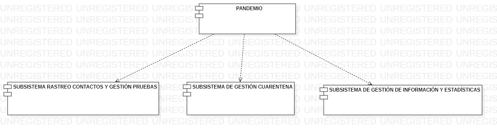

## 5. DESCRIPCIÓN DE LOS SUBSISTEMAS DEL SISTEMA A DESARROLLAR
Para la mejor compresión de la plataforma PANDEMIO que se deseea implementar, dividiremos dicha plataforma en distintos módulos que agruparán las funcionalidades necesarias. Estos subsistemas estarán descritos con mayor detalle en las siguientes tablas. Nos basamos en el diagrama de características del apartado de alcance (1.1).

| **\<id>001** | Rastreo de contacto entre casos positivos y Gestion de Pruebas Médicas|
| -- | -- |
| **[Versión]** | 1.0 (29/11/2020) |
| **[Dependencias]** |Dicho subsistema depende de los objetivos de negocio:  * 002 Rastreo del contacto con un positivo.  * 003 Asegurar la realización de las pruebas.  * 004 Identificar posibles focos de contagio. Contendrá los procesos de negocio a implementar:  * 001 Rastrear contactos con los casos positivos.   * 002 Gestionar la realización de las pruebas médicas.  |
| **Descripción** | Este subsistema agrupa los requisitos relacionados con el seguimiento de aquellos que han dado positivo en las pruebas, para así crear una lista de las personas afectada y todo aquello que tenga que ver con el rastreo de casos positivos para poder identificar posibles focos de contagio.  |
| **[Importancia]** | \<importancia del proceso de negocio para el cliente> |
| **[Prioridad]** | * Alta |
| **Comentarios** |  |

 <b>Tabla 8.1: Subsistemas a desarrollar.</b>   

| **\<id>002** | Gestión del cumplimiento de cuarentena |
| -- | -- |
| **[Versión]** | 1.0 (29/11/2020) |
| **[Dependencias]** | Dicho subsistema depende de los objetivos de negocio:  * 005 Asegurar el cumplimiento de la cuarentena.  Contendrá los procesos de negocio a implementar:  * 003 Gestionar el cumplimiento de la cuarentena.|
| **Descripción** | Este subsistema agrupa los requisitos relacionados con el control de aquellos ciudadanos que han dado positivo en la prueba y asegurandose que los pacientes cumplen el periodo de cuarentena. En caso de incumplimiento se notificara a las autoridades. |
| **[Importancia]** | \<importancia del proceso de negocio para el cliente> |
| **[Prioridad]** | * Alta |
| **Comentarios** | |

 <b>Tabla 8.2: Subsistemas a desarrollar.</b>   

| **\<id>003** | Gestión de información y estadísticas al gobierno |
| -- | -- |
| **[Versión]** | 1.0 (29/11/2020) |
| **[Dependencias]** | Dicho subsistema depende de los objetivos de negocio:  * 006 Proporcionar información y datos al ministerio .  Contendrá los procesos de negocio a implementar:  * 004 Suministrar información y estadísticas al gobierno.|
| **Descripción** | Este subsistema agrupa los requisitos relacionados con el suministro de información que se proporcionará al gobierno por parte de los datos recopilados y procesados por la plataforma PANDEMIO.  Estos datos generarán las distintas estadísticas que permitirán localizar los focos de contagio, zonas de más contagios, número de contagios por distrito médico,etc para que así el gobierno pueda tomar las decisiones oportunas. |
| **[Importancia]** | \<importancia del proceso de negocio para el cliente> |
| **[Prioridad]** | * Media |
| **Comentarios** | |

 <b>Tabla 8.3: Subsistemas a desarrollar.</b>   

Para que quede claro la descomposición en subsistemas, a continuación se muestra un diagrama de componentes con los subsistemas considerados.

  

