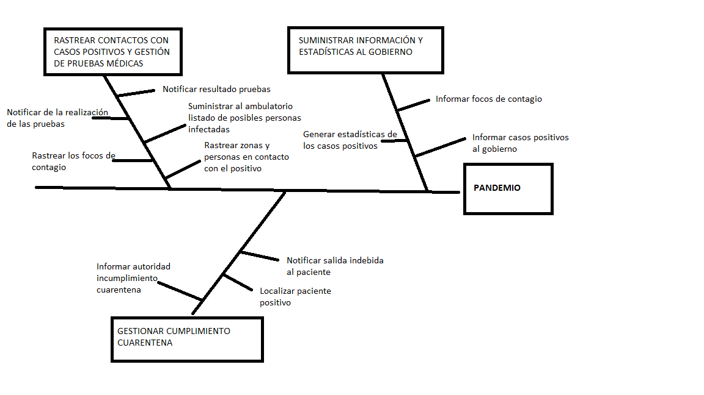
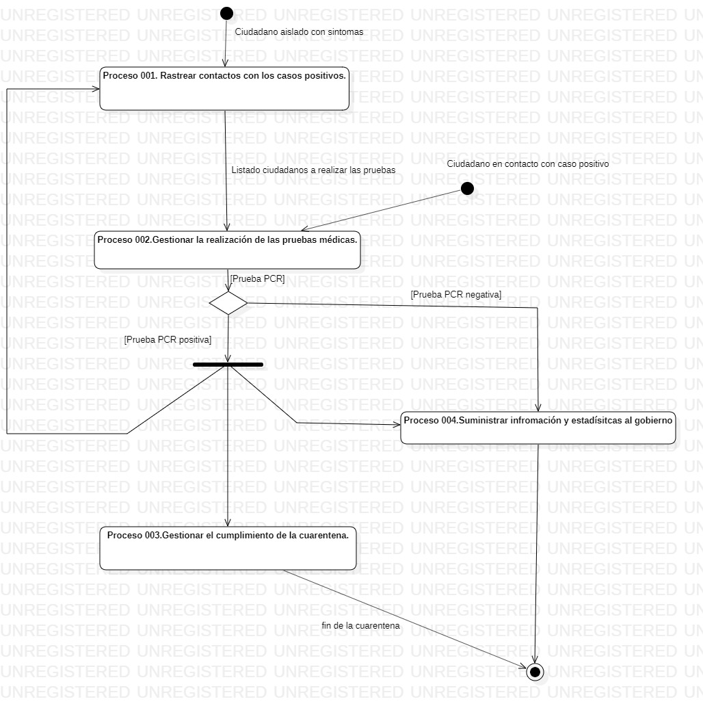
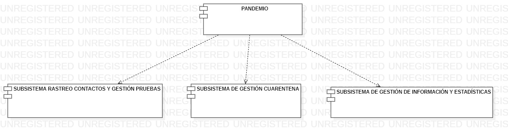
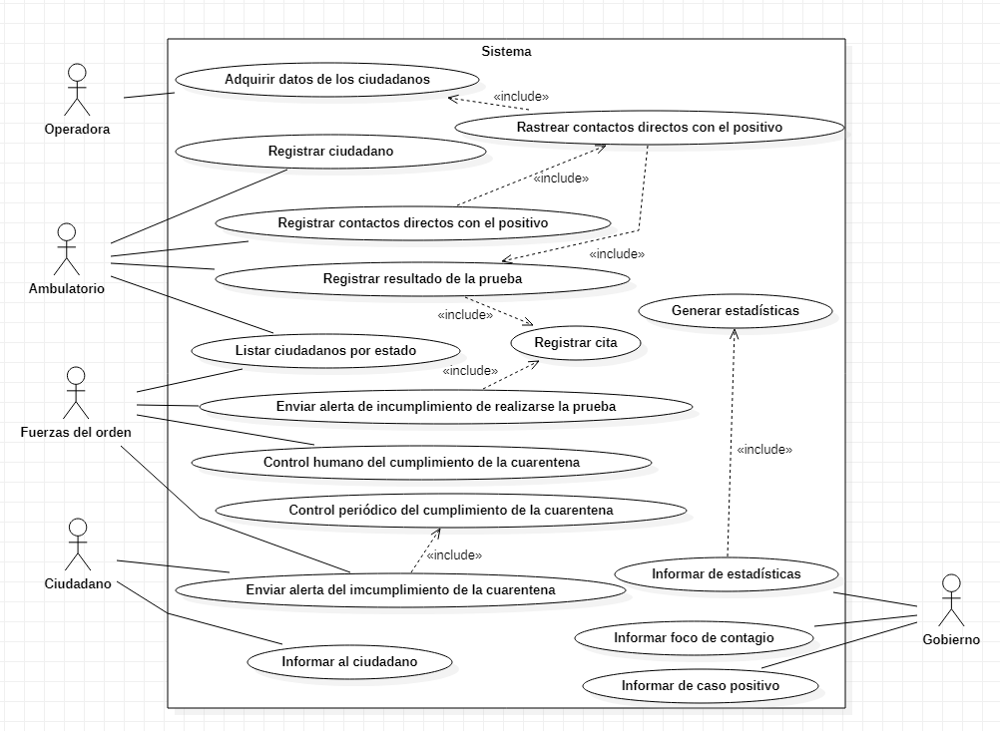

# PANDEMIO

## 1. INTRODUCCIÓN
Ante los resultados decepcionantes obtenidos con la aplicación **Radar Covid** para llevar a cabo el rastreo de los contagios entre los ciudadanos durante la pandemia, el Ministro de Sanidad ha propuesto desarrollar una plataforma que permita rastrear los casos Covid, así como gestionar los datos de los ciudadanos que sean positivos.

Con esta nueva plataforma que se propone desarrollar, se desea mitigar aquellos problemas que se han encontrado en la ya existente aplicación **Radar Covid**. Entre los cuales el comité de expertos resalta que son debidos a que la instalación y el uso de la aplicación NO eran obligatorios, por lo que pocos usuarios la instalaron y además dicha aplicación al basarse en el uso de bluetooth, la aplicación era inservible si el bluetooth estaba apagado o bien estaba ocupado.

Además, se propone que la nueva plataforma a desarrollar pueda llevar a cabo un seguimiento de aquellos ciudadanos que deben cumplir la cuarentena y no la cumplían, así como aquellos que no acudían a hacerse las pruebas médicas oportunas. Donde resulta importante que se cumpla la ley de datos y los datos de los ciudadanos solo sean usados por las personas autorizadas y sean anonimizados cuando sea posible.

Uno de los aspectos importantes que motiva el desarollo de la plataforma PANDEMIO, es que en la actual pandemia que nos encontramos hay personas que son positivos y que no presentan síntomas, los llamados casos asintomáticos. Dichos casos, son personas que contagian la enfermedad, pero es muy difícil detectar que son contagiadoras, dado que no presentan ningún síntoma que pueda hacer sospechar que están infectados. Por lo cual, se persigue que con la plataforma PANDEMIO, se pueda llevar un control mas preciso de los contactos para poder conocer si alguno de los contactos directos con los positivos puede ser un caso aintomático.

### 1.1 Alcance
Con el desarrollo de la plataforma PANDEMIO, se busca conseguir un sistema de control e información acerca de los contagios que se dan en una pandemia, en este caso de Covid-19, pero también nos servirá para otras pandemias que se pudieran presentar en un futuro.

Pandemio proporcionará distintos datos acerca de los contagios de los ciudadanos al ministerio de Sanidad, para que dichos datos sean procesados y se tomen las medidas oportunas por parte del juicio de expertos correspondiente. También, se proporcionarán los datos necesarios acerca de los contagios a los ambulatorios, así como a las autoridades correspondientes para que puedan llevar a cabo un control de que los casos positivos cumplen la cuarentena obligatoria cuando sea necesario.
El alcance del proyecto se centra en tres grandes características, el rastreo de los contactos con los casos positivos, gestionar la realización de las pruebas médicas y gestionar el cumplimiento de la cuarentena. Dentro de cada una de estas características se incluirá diferente funcionalidad, a continuación, se muestra un diagrama de característica que plasma cual es el alcance del proyecto de una forma más precisa.

 <b>Gráfico 1: Diagrama de característica del sistema a implementar.</b>   

### 1.2 Objetivos
Entre los objetivos que se desean alcanzar al desarrollar dicha plataforma se encuentran:

- Llevar a cabo un rastreo de los casos positivos entre los ciudadanos, así como conocer las personas que hayan estado en contacto con un positivo (durante un tiempo superior a 15 minutos)
- LLevar a cabo un control del correcto cumplimiento de la cuarentena por aquellos ciudadanos que la deban cumplir, notificando a la autoridad cuando se deja de cumplir la cuarentena.
- LLevar a cabo un control de aquellos ciudadanos que deben presentarse a las pruebas médicas oportunas, así como el resultado de estas.
- Proporcionar información de los distintos casos positivos que se detectan al ministerio de Sanidad, se debe informar del número de casos positivos que se encuentran en una determinada zona, ya sea por barrios, pueblos, etc. Para que los expertos epidemiólogos puedan tomar las medidas oportunas a partir de estos datos.
- Rastrear donde se han podido ocasionar los contagios entre los casos positivos, para que dicha información sea proporcionada al ministerio de sanidad y pueda tomar las medidas oportunas sobre permitir ciertas actividades o no.

## 2. INFORMACIÓN DEL DOMINIO DEL PROBLEMA
El 17 de noviembre de 2019 se detectó en China el primer caso de Covid-19, a partir de esta fecha y durante todo el año 2020 la situación mundial ha cambiado después de que el 11 de Marzo de 2020 la Organización Mundial de la Salud (**OMS**) declarara la enfermedad Covid-19 como pandemia.

Debido a esta pandemia, se han debido de tomar ciertas medidas, tales como el confinamiento domiciliario durante 99 días, la limitación de aforos en los comercios y los establecimientos, el toque de queda o el cierre de aquellos comercios que no se consideren esenciales. Debido a la cambiante e incierta situación que se está viviendo durante todos estos meses, dichas medidas están sufriendo constante modificaciones e incluso se añaden nuevas medidas, para tomar estas decisiones es necesario conocer las estadísticas y los datos acerca de la pandemia.

Uno de los aspectos más importantes que se deben de tener en cuenta para poder hacer frente a esta pandemia es el rastreo de todos aquellos casos positivos en la población, así como asegurar que los ciudadanos que sean positivos o hayan estado en contacto directo con positivos cumplan la cuarentena durante los días que indiquen los médicos.

Otro aspecto importante a tener en cuenta a la hora de rastrear los casos positivos es que aquellos ciudadanos que hayan estado en contacto con positivos o aquellas personas que tengan síntomas compatibles con Covid-19 acudan a los centros de salud a realizarse las pruebas médicas oportunas.

Para asegurarse que todas estas medidas anteriormente comentadas se cumplan por parte de los ciudadanos se dispone del apoyo de las fuerzas del orden (policía local, nacional, guardia civil y ejército).

### 2.1 Introducción al dominio del problema
A la hora de actuar ante un nuevo caso positivo en Covid-19, se debe seguir un protocolo estricto. El cuál consiste en que una vez que se conoce el resultado positivo de la prueba PCR oportuna, el paciente positivo debe permanecer en cuarentena durante 15 días, en los cuales no podrá salir de casa o incluso de su habitación en caso de que conviva con más personas que no sean positivas.

Después, se llevará a cabo un seguimiento de todas aquellas personas que hayan estado en contacto (durante un tiempo superior a 15 minutos) con el paciente positivo en las 48 horas anteriores a la realización de la prueba PCR, a las cuales se les considerará contacto directo. Los contactos directos deben permanecer en cuarentena hasta que se conozca el resultado de la prueba PCR, si esta es negativa en algunos casos se debe mantener la cuarentena unos días más (depende del tipo de contacto, tiempo, si ha sido con mascarilla o sin ella, etc.) en caso de que lo indique el responsable sanitario. Si la prueba es positiva, se repetirá el mismo proceso con los contactos directos del nuevo caso positivo.

### 2.2 Glosario de términos
- **Asintomático:** Aquella persona que padece una enfermedad pero no presenta síntomas de ella.
- **Caso positivo:** Aquella persona que tras la realización de la prueba oportuna ha indicado que tiene la enfermedad por la cual se hace la prueba.
- **Confinamiento:** Acción que se lleva cabo para mantener a una persona positiva dentro de unos límites (en este caso su vivienda), con el fin de que no contagie al resto de la población.
- **Contacto directo:** Aquella persona que ha estado en contacto con un caso confirmado de Covid-19 desde las 48 horas antes del inicio de síntomas o del diagnóstico. Entre estas, son más probables de ser positivos aquellas que hayan estado en el mismo lugar que un caso positivo, a una distancia menor de 2 metros durante un tiempo superior de 15 minutos.
- **Covid-19:** Enfermedad infecciosa causada por el coronavirus SARS-COV-2.
- **Cuarentena:** Ponerse en cuarentena significa separarse de los demás porque ha estado expuesto a alguien con COVID‑19 aunque usted mismo no tenga síntomas. Durante la cuarentena, debe vigilar su estado para detectar síntomas. El objetivo de la cuarentena es prevenir la transmisión.
- **Pandemia:** Enfermedad epidémica que se extiende a muchos países o que ataca a casi todos los individuos de una localidad o región.
- **Prueba PCR:** Tipo de prueba de diagnóstico, que permite detectar un caso positivo de Covid-19.
- **Toque de queda:**  se refiere a la prohibición o restricción, establecida por instituciones gubernamentales, de circular libremente por las calles de una ciudad o permanecer en lugares públicos, permaneciendo los habitantes únicamente en sus hogares salvo excepciones de necesidad o urgencia.

## 3. DESCRIPCIÓN DE LA SITUACIÓN ACTUAL
Desde que se declaró el estado de alarma como consecuencia de la actual pandemia que estamos viviendo, se han debido de tomar diversas medidas, las cuales han ido cambiando constantemente, debido a la cambiante situación que se plantea con la pandemia cada día. Para poder tomar estas medidas, el gobierno junto con el grupo de expertos indicado debe conocer grandes volúmenes de información acerca de la pandemia y contrastarla.

Entre las medidas tomadas cabe destacar el confinamiento domiciliario al cual hemos estado sometidos cerca de 3 meses. Una vez que la situación mejoró se ha permitido el salir a la calle, pero con un límite en el número de personas que se podían juntar. Los locales comerciales, la hostelería, las grandes superficies han debido de tomar distintas medidas respecto al aforo y a los protocolos que se debían respetar.

Actualmente, las medidas tomadas son distintas dependiendo de las comunidades autónomas (dependen de los datos de la pandemia en dichas comunidades), y además dichas medidas cambian constantemente; luego no podemos suponer que la situación de hoy en día sea igual a la que se va a presentar mañana.

Actualmente el Ministerio de Sanidad posee una aplicación para el control y seguimiento ciudadano en términos de la pandemia mundial que nos asola causada por el COVID-19; sin embargo, esta aplicación no es del agrado del ministerio por diversas razones. Para poder llevar a cabo una mejor gestión, que la proporcionada por la aplicación actual, en caso de producirse una nueva pandemia, el ministerio quiere hacerse con nuestros servicios para la creación de una nueva aplicación que sí satisfaga sus necesidades ante una posible situación similar en el futuro. 

Hoy en día todo el mundo lleva su móvil en todo momento consigo, móviles conectados a la red y que funcionan por medio de aplicaciones. Nos aprovecharemos este entorno tecnológico ya que es ideal para el seguimiento ciudadano. Puesto que las fuerzas del orden, así como el sector sanitario posee también de dispositivos conectados a la red podremos comunicarnos con ellos. De esta manera se podrá comprobar el cumplimiento de las cuarentenas y las obligaciones de los ciudadanos por parte de los cuerpos de seguridad del estado, así como recibir listas, los ambulatorios, con las personas que deberán hacerse las pruebas para poder poner en conocimiento de las fuerzas del orden cualquier incumplimiento.

En la actualidad en torno al 90% de la población española dispone de un teléfono móvil, luego esto tiene las ventajas comentadas anteriormente para poder hacer el seguimiento oportuno a los ciudadanos de cara a obtener datos válidos para gestionar la pandemia. Sin embargo, el otro tanto por ciento de la población que no dispone de teléfono móvil se encuentra en una situación especial que se debe tener en cuenta de cara a conocer cómo se va a actuar en nuestra plataforma en estos casos. Dado que dicho porcentaje de la población es muy reducido y además se corresponde con la población de menor edad y la población de edades avanzadas el rastreo de los contactos directos de estas personas se puede rastrear de forma manual con los métodos actuales, dado que estos grupos de población no tienen muchos contactos sociales distintos. A la hora de controlar el cumplimiento de la cuarentena en este tipo de usuarios, se delegará la responsabilidad en las fuerzas del orden, las cuales deberán hacer los controles oportunos, lo cual es viable al ser un número reducido de personas. 

Dado que, con nuestra plataforma, Pandemio, vamos a poder obtener distintos datos de los ciudadanos, se van a manejar grandes volúmenes de información acerca de estos, lo que conlleva que los algoritmos utilizados para obtener información de estos datos o para manejar estos datos sean complejos. Dichos datos debe ser información anonimizada, tan solo podrán acceder a los datos los usuarios autorizados para ello como los agentes de la autoridad o los ambulatorios. Hoy en día, se debe tener un especial cuidado a la hora de manejar datos relacionados con las personas, y se debe cumplir la ley de protección de datos.

Debido a que la situación actual ha llevado a que se transfieran las competencias a las autonomías y cada una tiene sus propios sistemas de información, para poder realizar una implementación correcta en todas las autonomías deberemos de establecer distintas interfaces de comunicación entre ellas para poder acceder a sus sistemas de información y así acceder a los datos de los pacientes de cada autonomía.

### 3.1 Pros y Contras de la Situación Actual
La situación actual hace que para la implementación de la aplicación que se nos solicita se nos presentan varios puntos que podrían ser de ayuda, pero también cuestiones que suponen un obstáculo a la hora de cumplir con las necesidades del cliente. 

Puesto que tenemos una aplicación realizada y probada recientemente en el mismo ámbito y con propósitos similares podremos realizar comparaciones con ella y establecer un punto de partida sólido. Tendremos en cuenta aquellos aspectos que han funcionado y aquellos que no y sus razones para poder aprender de ella y mejorar.

#### 3.1.1 Fortalezas de la Situación Actual
Para poder enfrentarnos al problema con un punto de partida fuerte aprovecharemos que tenemos el backup o copia de seguridad de la aplicación __Radar Covid__ de la que podemos sacar numerosas conclusiones para usarlas en nuestro favor.

Puesto que la situación de la pandemia actual es una situación crítica se nos proporcionarán ciertos privilegios y facilidades proporcionándonos legalidad para ciertos asuntos que ahora mismo suponen un problema.

De toda esta situación podemos resumir las siguientes fortalezas en cuanto a nuestra situación actual:

| **\<id>001** | Reciente pandemia del COVID-19 |
| -- | -- |
| **[Versión]** | 1.0 (17/11/2020) |
| **Descripción** | Dado que actualmente existe la pandemia del Covid-19, hemos adquirido la suficiente experiencia de cómo se debe actuar ante una pandemia y cúales deben ser las medidad a tomar. Es decir, tendremos un conocimiento previo y un conjunto de técnicas que se podrán aplicar de cara a controlar la pandemia y no actuaremos desde cero. |
| **Comentarios** | En la actualidad se conocen los protocolos de actuación ante una pandemia, la sociedad conoce el cómo actuar y dispone de una experiencia previa de ello. Además, se dispone de datos previos y estudios acerca de la eficacia de las diferentes mediadas tomadas en la actual pandemia. |
  

 <b>Tabla 1.1: Fortalezas de la situación actual.</b> 

  
| **\<id>002** | Referencia Aplicación "Radar Covid" |
| -- | -- |
| **[Versión]** | 1.0 (17/11/2020) |
| **Descripción** | En la actualidad existe otra aplicación del ministerio llamada Radar Covid, la cual la base de su funcionalidad es parecida a la de nuestra plataforma, la idea de controlar los contagios surge de esta aplicación y se tratará de mejorar las deficiencias encontradas en ella. A partir de esta aplicación se dispone de una base para comenzar a desarrollar nuestra plataforma. |
| **Comentarios** | Usaremos como fortaleza de esta aplicación la idea de controlar los contactos con los positivos, pero la implementación sufrirá modificaciones, ya que se usarán los datos proporcionados por las operadoras móviles, en vez de el uso de bluetooth por los problemas encontrados en su uso. |
  

 <b>Tabla 1.2: Fortalezas de la situación actual.</b> 

    
| **\<id>003** | Existencia de datos sobre la población |
| -- | -- |
| **[Versión]** | 1.0 (18/11/2020) |
| **Descripción** | Debido a la actual pandemia del COVID-19 los distintos estamentos del gobierno y sus autonomías han podido recabar información sobre la población en vistas a poder prevenir la extensión del virus. |
| **Comentarios** | Con cada llamada a los teléfonos habilitados para la población para temas de COVID-19 el protocolo marcaba imprescindible recabar datos sobre la persona que realizaba la llamada, tales como la edad o el código postal. De confirmarse el positivo, y con el objetivo de realizar el rastreo se le preguntaba al usuario las personas con las que había mantenido contacto en los días previos, así como su dirección y los lugares donde había estado durante un periodo largo de tiempo. Toda esa información que ya tenemos podría ser usada en un futuro para realizar estudios que nos permitieran llevar a cabo una actuación más rápida y eficiente a la hora de encontrar infectados y adelantarnos en una posible nueva pandemia para minimizar la propagación. |
  

 <b>Tabla 1.3: Fortalezas de la situación actual.</b> 

  
| **\<id>004** | Acceso a los datos de los operadores móviles |
| -- | -- |
| **[Versión]** | 1.0 (17/11/2020) |
| **Descripción** | Gracias a que la situación de pandemia ha llevado a que se declare un estado de alerta sanitaria se dispone de una situación en la cual se pueden hacer los cambios legales necesarios, entre ellos que los datos acerca de los ciudadanos sean proporcionados por las propias operadoras con el fin de usar esta información para nuestra plataforma y no con otros fines. Dichos datos son los más precisos que se pueden obtener, y en ellos no tiene que intervenir el usuario, sino que son obtenidos sin su "consentimiento". |
| **Comentarios** | Tomaremos como fortaleza el hecho de que al obtener los datos de las operadoras móviles, el usuario no se puede negar a proporcionar dichos datos y además, se evitan los posibles despistes de tener desconectado el bluetooth como ocurría con Radar Covid o que al utilizarse otro dispositivo, no se registren los nuevos contactos directos. |
  

 <b>Tabla 1.4: Fortalezas de la situación actual.</b> 

  
| **\<id>005** | Posibilidad de realizar los cambios legales necesarios |
| -- | -- |
| **[Versión]** | 1.0 (17/11/2020) |
| **Descripción** | Dado que nuestro cliente es el Ministerio de Sanidad, se está planteando crear un estado de alerta sanitaria o pandemia con el fin de que dicho estado de alerta sirva como paraguas para poder realizar los cambios legales necesarios a la hora de poder implementar de una forma correcta nuestra plataforma y poder obtener los datos necesarios para ello. |
| **Comentarios** | Se tomará como fortaleza el hecho de que, si existe algún impedimento legal a la hora de poder implementar nuestra plataforma, al estar destinada al gobierno se podrán realizar los cambios legales necesarios para eliminar dichos impedimentos o reducirles. |
  

 <b>Tabla 1.5: Fortalezas de la situación actual.</b> 

  
| **\<id>006** | Disponibilidad de móvil de gran parte de la población |
| -- | -- |
| **[Versión]** | 1.0 (17/11/2020) |
| **Descripción** | En la actualidad cerca del 90% de la población española dispone de teléfono móvil, luego esto es una gran fortaleza dado que podremos obtener información de una gran parte de la población gracias a sus dispositivos móviles. Además, se podrá utilizar a su vez como dispositivo para controlar que se cumplen con las cuarentenas obligatorias así como medio de comunicación con el ciudadano. |
| **Comentarios** | El pequeño porcentaje de la población que no dispone de teléfono móvil se suele corresponder con niños o personas de edad avanzada, las cuales es más fácil de rastrear sus contagios y si cumplen la cuarentena obligatoria, para ello hará falta de la actuación de los agentes de la autoridad o personas asignadas para ello. |
  

 <b>Tabla 1.6: Fortalezas de la situación actual.</b> 

  
| **\<id>007** | Comunicación con las fuerzas del orden y los sanitarios |
| -- | -- |
| **[Versión]** | 1.0 (18/11/2020) |
| **Descripción** | Para poder llevar a cabo un control eficiente de las personas que deben realizarse las pruebas enviaremos a los ambulatorios los listados de personas que deben hacerse las pruebas, y estos podrán notificar a la autoridad el incumplimiento. Por su parte las fuerzas del orden podrán comprobar el cumplimiento de las cuarentenas y las obligaciones impuestas a los ciudadanos. |
| **Comentarios** | Nuestra labor será la de recabar información que proporcionaremos a los ambulatorios y a sanidad para que puedan llevar a cabo las acciones pertinentes, pero el hecho de que estemos en comunicación directa con organismos con tanto "poder" debería influir positivamente en el éxito de nuestro proyecto. |
  

 <b>Tabla 1.7: Fortalezas de la situación actual.</b> 

#### 3.1.2 Debilidades de la situación Actual
Debido a la complejidad de la situación actual y a que la aplicación __Radar Covid__ ha ofrecido muchos puntos en contra pero pocos a favor nos encontramos en una posición donde todo aquello que queramos implementar puede ser muy buena idea sobre el papel pero causar muchas dificultades en un contexto real.

Por otro lado, para poder llevar a cabo ciertas operaciones vamos a necesitar del uso de los datos de localización de los móviles y eso, por el momento supone un problema. Aun así, cuando esto esté solucionado deberemos lidiar con el cumplimiento de la ley de protección de datos.

De toda esta situación podemos resumir las siguientes debilidades en cuanto a nuestra situación actual:

| **\<id>001** | Problemas en el uso de Bluetooth |
| -- | -- |
| **[Versión]** | 1.0 (18/11/2020) |
| **Descripción** | La aplicación Radar Covid intentó realizar la localización de los usuarios y sus interacciones por medio del bluetooth sin embargo resultó ser inservible si este estaba apagado o siendo usado por otro accesorio.|
| **Comentarios** | Supone una debilidad el hecho de que la "primera opción" para localizar a los usuarios haya fracasado y por tanto tendremos que buscar otra opción mejor.| 

 <b>Tabla 2.1: Debilidades de la situación actual.</b> 

  
| **\<id>002** | Opcionalidad de los usuarios para estar controlados |
| -- | -- |
| **[Versión]** | 1.0 (18/11/2020) |
| **Descripción** | La obtención de Radar Covid por parte del usuario era totalmente voluntaria, lo que supone un gran problema ya que el usuario que lo deseara podría ser "invisible" desde el punto de vista de la aplicación. |
| **Comentarios** | Para poder paliar la debilidad de que los usuarios decidan no tener la aplicación nosotros contamos con los datos de las operadoras sobre los registros de localización de los usuarios con lo que el usuario estará "monitorizado" sin saberlo (ver Tabla 1.4). | 
  

 <b>Tabla 2.2: Debilidades de la situación actual.</b> 

  
| **\<id>003** | Irresponsabilidad de los usuarios en el cumplimiento de las recomendaciones |
| -- | -- |
| **[Versión]** | 1.0 (18/11/2020) |
| **Descripción** | Una vez diagnosticado un positivo y alertado a los posibles contagiados dependemos de la responsabilidad de cada uno de ellos para cumplir con las normas y las restricciones que se les apliquen. En caso de que no sea así tendremos dificultades para llevar un control de la actividad del usuario y posibles brotes. |
| **Comentarios** | Para resolver el problema contamos con la ventaja de que podremos avisar a las fuerzas del orden para que estén al tanto de las personas que deben estar en cuarentena y asegurar su cumplimiento (ver Tabla 1.7). También se podrá hacer el control del cumplimiento de la cuarentena, por medio de la localización del dispositivo móvil de los pacientes o por medio de llamadas telefónicas a estos. (ver tabla 1.6). | 
  

 <b>Tabla 2.3: Debilidades de la situación actual.</b> 

 
| **\<id>004** | Independencia a nivel autonómico en la gestión de los datos |
| -- | -- |
| **[Versión]** |  1.0 (18/11/2020) |
| **Descripción** | Actualmente se han transferido las competencias en la gestión de la pandemia a las autonomías, teniendo cada una sus propios sistemas de información. |
| **Comentarios** | Para solventar esta debilidad deberemos hablar con cada autonomía para poder adaptar nuestro proyecto a trabajar con cada uno de los respectivos sistemas de información. | 
  

 <b>Tabla 2.4: Debilidades de la situación actual.</b> 

| **\<id>005** | Gran volumen de datos a gestionar y algaritmos complejos|
| -- | -- |
| **[Versión]** |  1.0 (26/11/2020) |
| **Descripción** | Debido a los númerosos datos que se deben de gestionar de los usuarios, tales como el historial de localizaciones, el resultado de sus pruebas médicas o los datos personales de este, se deben de manejar grandes volúmenes de información por lo que se necesitará disponer de grandes computadoras, grandes servidores o bases de datos, por lo que la implementación de esta plataforma no está al alcance de cualquiera, se necesita el uso de estos grandes computadores.  Además, dado esta gran cantidad de datos, se deberá disponer de algoritmos bastante complejos para poder obtener distinta información acerca de ellos y estos deben de ser eficientes.  |
| **Comentarios** | Para solventar esta debilidad deberemos de disponer o contratar los servicios de grandes computadoras como mare nostrum. | 
  

 <b>Tabla 2.5: Debilidades de la situación actual.</b> 

| **\<id>006** | Personas asintomaticas |
| -- | -- |
| **[Versión]** |  1.0 (26/11/2020) |
| **Descripción** | En la actualidad, la enfermedad de la pandemia, hace que haya personas asintomáticas, es decir personas infectadas pero que no presentan síntomas, dichas personas pueden contagiar al resto de ciudadanos y no se sabe que están contagiando al resto. Lo cual, esto ayuda a que se propague el virus entre la población y se pueda desbordar la pandemia y los infectados. |
| **Comentarios** | Para solventar esta debilidad deberemos de rastrear cuales han sido los contactos directos con los positivos para así poder realizarles las pruebas médicas oportunas.| 
  

 <b>Tabla 2.6: Debilidades de la situación actual.</b> 

### 3.2 Modelos de Procesos de Negocios Actuales
En este apartado representaremos y describiremos todos aquellos procesos que se llevarán a cabo para gestionar los contagios que se producen en la pandemia, así como los procesos que se emplearán para controlar el cumplimiento de la cuarentena obligatoria por parte de los ciudadanos positivos. También se tendrán en cuenta todos aquellos procesos en los que se gestionen las distintas pruebas médicas que se deben realizar los ciudadanos, asi como informales a estos de los resultados. Por otro lado, se especificará como debe ser la comunicación con el resto de los actores que intervienen en la plataforma como los agentes de la autoridad o el gobierno al que se le proporcionarán todos los datos obtenidos con la plataforma para que puedan tomarse las medidas oportunas por parte de los expertos correspondientes.

#### 3.2.1 Descripción de los Actores de Negocio Actuales
Los actores de negocio actuales son todas aquellas personas o entidades que están involucradas en la gestión de la pandemia actual y en los procesos de negocio llevados a cabo. Dichos actores se corresponden con: ciudadanos, gobierno, autoridades y ambulatorios. Necesarios para que la información se transmita de manera segura.

| **\<id>001** | Ciudadano |
| -- | -- |
| **[Versión]** | 1.0(17/11/2020) |
| **[Dependencias]** | El ciudadano es la piedra angular del proceso y por ello la mayoría de los procesos de negocio actuales dependen de él. El proceso 1, "Hacer prueba PCR", depende directamente del ciudadano ya que es objeto de dicha prueba. Por el mismo motivo también depende el proceso 2, "Registrar resultado de la prueba". El proceso 3, "Rastreo por contacto con un positivo", depende también de este actor ya que un resultado positivo en un ciudadano recae en la realización de pruebas en otros ciudadanos. Por último el proceso control de la cuarentena y seguimiento del estado del paciente, proceso 4, depende del ciudadano por razones obvias. |
| **Descripción** | Este actor de negocio actual es el actor principal en torno al que gira todo el sistema. Representa a cada uno de los ciudadanos. De este actor se obtiene la información de su localización por medio de la tecnología bluetooth de su móvil para que si se produce un positivo poder alertar a aquellas personas que hayan tenido contacto. La llamada de un ciudadano por padecer síntomas y la realización de una PCR es lo que dispara los diferentes procesos de negocio, ya que si se produce un positivo este debe guardar una cuarentena sobre la que se realiza un seguimiento además de iniciarse un rastreo de los posibles ciudadanos que también puedan haber sido contagiados. La información sobre los resultados de las pruebas y sobre el seguimiento del ciudadano positivo se pone en conocimiento de los rastreadores que llevan a cabo las acciones pertinentes. |
| **Comentarios** | De la información obtenida por medio de los ciudadanos positivos, como la residencia, los puntos de visita frecuentes o las personas con las que ha mantenido contacto se sacan conclusiones por medio de su análisis que puedan dar lugar a toma de decisiones. |

 <b>Tabla 3.1: Actores de negocio.</b> 

| **\<id>002** | Gobierno |
| -- | -- |
| **[Versión]** | 1.0(17/11/2020) |
| **[Dependencias]** | De este actor depende el proceso de negocio 5, "Toma de decisiones", ya que es el encargado de tomar las medidas o imponer las restricciones en función del análisis de la información disponible. |
| **Descripción** | Este actor de negocio actual representa al gobierno, en concreto al ministro de sanidad, al que se le suministrarán todos los datos y estadísticas que se han obtenido por medio del procesamiento de los datos capturados de los ciudadanos y procesados. Dicho actor se encargará como entidad de tomar las decisiones oportunas en función de los datos suministrados por la plataforma, en base a diferentes criterios. |
| **Comentarios** | Es un actor que se encuentra "aislado" del proceso de detección y seguimiento de positivos pero que será muy importante debido a su capacidad de toma de decisiones. Este actor puede imponer medidas nuevas, protocolos diferentes y alterar de manera importante todos los procesos tal y como se llevan a cabo hasta ahora. Es por ello que, aunque se encuentre fuera del flujo normal es importantísimo incluirlo por su capacidad de cambiar el mismo. |

 <b>Tabla 3.2: Actores de negocio.</b> 

| **\<id>003** | Autoridades |
| -- | -- |
| **[Versión]** | 1.0(17/11/2020) |
| **[Dependencias]** | Dicho actor participa en los procesos de negocio 3 Rastreo por contacto con positivo y en el proceso 4 llevar seguimiento del paciente y control de su cuarentena. |
| **Descripción** | Este actor de negocio actual representa a las fuerzas del orden (policía local, nacional, guardia civil y el ejército) que se encargan de rastrear cuales han sido los contactos directos con los positivos y proveer dicha información a los ambulatorios para que sean los encargados de llamar a dichos contactos directos para que se les realicen las pruebas médicas oportunas. También son los encargados de controlar el cumplimiento de las cuarentenas obligatorias por parte de los ciudadanos que deban de cumplirlas, para ello se encargan de hacer llamadas telefónicas o videollamadas con los pacientes positivos para comprobar que se encuentran en casa cumpliendo la cuarentena. |
| **Comentarios** | A este actor en determinadas ocasiones se les llama rastreadores, y llevaran a cabo la misión de rastrear el cómo se producen los contagios entre los positivos, asi como obtener cuales son los brotes de dichos contagios, para ello tan solo disponen de la información proporcionada por los pacientes positivos. |

 <b>Tabla 3.3: Actores de negocio.</b> 

| **\<id>004** | Ambulatorio |
| -- | -- |
| **[Versión]** | 1.0(17/11/2020) |
| **[Dependencias]** | Este actor entra en juego en la mayoría de los procesos de negocio, dado que es el conocedor de cómo se debe gestionar la pandemia y se encarga de mediar en cómo se debe actuar en los distintos casos. Los procesos de negocio en los que participa son 1 Hacer prueba PCR, 2 Registrar resultado de la prueba PCR, 3 rastreo por contacto con positivo, 4 llevar seguimiento del paciente y control de su cuarentena y 5 interpretación de los datos. |
| **Descripción** | Este actor de negocio actual representa al centro de salud, asi como los responsables médicos, se encargan de determinar si se les debe de realizar las pruebas a los pacientes ante la aparición de síntomas o por contacto directo, también se encargan de concretar las citas para la realización de las pruebas médicas con los pacientes, así como informarles de los resultados obtenidos en dichas pruebas y en caso de ser positivos solicitan los datos de los contactos directos.   Por otra parte, se encargan de registrar los resultados de dichas pruebas en la base de datos del centro de salud, para que posteriormente pueda ser proporcionada esta información al gobierno. También se encargan de realizar un seguimiento de la evolución del estado del paciente durante la cuarentena por medio de las llamadas telefónicas. |
| **Comentarios** | Dicho actor en determinadas ocasiones se les llama responsable Covid y es el encargado de realizar todas las acciones anteriormente comentadas respecto a la gestión de los casos covid en cada uno de los ambulatorios. |

 <b>Tabla 3.4: Actores de negocio.</b>   

#### 3.2.2 Descripción de Procesos de Negocio Actuales
En este apartado se comentarán cúales son los procesos de negocio que se llevan a cabo en la actualidad para gestionar la pandemia. Dichos procesos son en los que se basará nuestra plataforma para agilizarlos y poder ser llevadas a cabo de una forma más automatizada. De forma general, se comentará cual es el flujo de procesos que se han de llevar a cabo cuando se detectan los síntomas compatibles con la enfermedad. Dichos procesos son los siguientes:

| **\<id>001** | Hacer prueba PCR |
| -- | -- |
| **[Versión]** | 1.0(17/11/2020) |
| **[Dependencias]** | En algunos casos depende del proceso de negocio 3, Rastreo de contacto con el positivo, sin embargo, en otros casos no hay ninguna dependencia cuando se registra un caso aislado. |
| **Descripción** | En la actualidad, cuando un ciudadano presenta síntomas compatibles con la enfermedad, debe de llamar al centro de salud al que esté asignado e indicará cuales son los síntomas que presenta. El responsable Covid de cada centro de salud, será el encargado de tomar la decisión de si se le debe realizar las pruebas oportunas, en la mayoría de los casos se realizan. El centro de salud concretará una cita médica con el paciente para realizarle las pruebas oportunas.   El paciente acudirá al centro médico el día de la cita y se le realizarán las pruebas necesarias, en la mayoría de los casos son una prueba PCR o una prueba de sangre, según el criterio del responsable médico. Después de esto, el paciente debe de dirigirse a su residencia y debe permanecer en cuarentena hasta el resultado de las pruebas realizadas, que en general, no tardarán más de 24-48 horas. |
| **[Importancia]** | Alta |
| **[Actores]** | * Ciudadano   * Ambulatorio |
| **Comentarios** | El medio de comunicación en todo momento son las llamadas telefónicas.|

 <b>Tabla 4.1: Procesos de Negocio actuales.</b>   

| **\<id>002** | Registrar resultado prueba PCR |
| -- | -- |
| **[Versión]** | 1.0 (17/11/2020) |
| **[Dependencias]** | Este proceso de negocio depende del proceso 1 hacerse prueba PCR, dado que si no se ha realizado previamente una prueba PCR el paciente, no se puede tener una base en la que basarse para actuar de una forma u otra. |
| **Descripción** | Una vez que el paciente se ha realizado las pruebas oportunas, y se encuentra confinado en su casa, el ambulatorio le llamará para informarle del resultado de las pruebas lo antes posible y en cuanto se conozca el resultado de estas. Además, el ambulatorio se encargará de registrar en su base de datos el resultado de dicha prueba, para que así esta información sea procesada por parte de los responsables sanitarios y se puedan obtener las estadísticas oportunas.   Dependiendo del resultado de dicha prueba, se tomarán distintas medidas, si el resultado es positivo, el paciente deberá permanecer aislado y no podrá salir de casa, si convive con mas personas, dichas personas serán detectadas como contacto directo (ver proceso de negocio 3 Rastreo de contacto con positivo) y se les realizarán las pruebas oportunas, si son negativas o hasta que se conozca el resultado de dichas pruebas deberá permanecer aislado en su habitación y no podrá salir de esta a no ser que sea necesario (y con mascarilla siempre). Si el resultado es negativo pero al paciente se le considera contacto directo con un positivo confirmado, deberá permanecer en cuarentena durante 10 días. Si el paciente es negativo,y no es un contacto directo con un caso positivo confirmado, podrá hacer vida normal a no ser que los síntomas persistan que se le repetirá las pruebas por si es un caso de falso negativo.|
| **[Importancia]** | Alta |
| **[Actores]** | * Ambulatorio>   * Ciudadano |
| **Comentarios** | La comunicación se realiza por medio de llamadas telefónicas. Se tienen en cuenta numerosos factores para decidir cúal es la forma de actuar en cada caso. |

 <b>Tabla 4.2: Procesos de Negocio actuales.</b>    

| **\<id>003** | Rastreo por contacto con positivo |
| -- | -- |
| **[Versión]** | 1.0 (19/11/2020) |
| **[Dependencias]** | Este porceso de negocio depende totalmente del proceso 2, "Registrar resultado de la prueba PCR", ya que unicamente entra en juego con un resultado positivo de la prueba realizada al ciudadano. |
| **Descripción** | A día de hoy en la llamada que se realiza con el usuario susceptible de ser positivo se le solicitan a este los nombres de todas aquellas personas con las que ha mantenido contacto directo a lo largo de las úlitmas horas, normalmente las 48 horas previas a la manifestación de síntomas. En  caso de confirmarse el positivo del usuario los sanitarios y/o las autoridades proceden a contactar con aquellos cuidadanos que el positivo suministró en un primer momento para poder realizarles las pruebas pertinentes a cada uno de ellos y volver a comenzar con el proceso.|
| **[Importancia]** | Alta|
| **[Actores]** | * Ambulatorio   * Cuidadano   * Autoridades |
| **Comentarios** | Actualmente tenemos que confiar en que el usuario nos proporcione todos los contactos que ha tenido en las horas previas. En este sentido tenemos el handicap de que el usuario puede no recordarlos todos y/o no querer proporcionarlos todos por conveniencia.|

 <b>Tabla 4.3: Procesos de Negocio actuales.</b>   

| **\<id>004** | Llevar seguimiento del paciente y control de su cuarentena |
| -- | -- |
| **[Versión]** | 1.1 (19/11/2020) |
| **[Dependencias]** | Este porceso de negocio depende totalmente del proceso 2, "Registrar resultado de la prueba PCR", ya que unicamente entra en juego con un resultado positivo de la prueba realizada al ciudadano. |
| **Descripción** | Actualmente una vez se detecta un positivo, este queda automaticamente puesto en cuarentena de 10 a 15 días dependiendo del caso. Para poder llevar a cabo un seguimiento de esta cuarentena los sanitarios y/o las autoridades realizan llamadas con frecuencia al paciente. Con esta llamada se pretede controlar que el usuario está cumpliendo las restricciones impuestas así como llevar a cabo un seguimiento sobre su estado de salud|
| **[Importancia]** | Media |
| **[Actores]** | * Ambulatorio   * Cuidadano   * Autoridades |
| **Comentarios** | Este proceso de negocio finalizaría una vez termine esta cuarentena, dando por hecho que, pasado el tiempo estimado, el paciente estará sano y no puede contagiar|

 <b>Tabla 4.4: Procesos de Negocio actuales.</b>    

| **\<id>005** | Interpretación de los datos |
| -- | -- |
| **[Versión]** | 1.0(17/11/2020) |
| **[Dependencias]** | Dicho proceso de negocio depende sobre todo del proceso 2 registrar casos positivos (para conocer los positivos que hay en cada centro de salud) y del proceso 3 Rastreo por contacto con positivo (para conocer de donde provienen dichos contagios). |
| **Descripción** | Una vez que los casos positivos han sido registrados en las bases de datos de los ambulatorios, estos pueden proporcionar dicha información al gobierno, para que estos tomen las medidas oportunas en función de estos datos proporcionados y las estadísticas obtenidas. |
| **[Importancia]** | Alta |
| **[Actores]** | * Gobierno   * Ambulatorios |
| **Comentarios** | El gobierno debe de pedir los datos sanitarios a los ambulatorios "en crudo" y por medio de los expertos del gobierno se realizarán las estadísticas oportunas con la escasa información que se dispone de cada caso, para posteriormente tomar decisiones. Pero los ambulatorios no disponen de dicha información de forma directa. |

 <b>Tabla 4.5: Procesos de Negocio actuales.</b>   

### 3.3 Entorno Tecnológico Actual

Pandemio surge como necesidad de mejorar diferentes aspectos negativos encontrados en la ya existente aplicación Radar Covid, aparte de introducir nueva funcionalidad para poder gestionar los datos acerca de la pandemia. Además, a parte de esta aplicación en la actualidad se encuentran otras con una funcionalidad parecida, como se ha comentado en el apartado 3.0.

Dado que, en la actualidad, la sociedad está muy concienciada con las nuevas tecnologías y cada vez está más acostumbrada al uso de la tecnología en su vida diaria, hace que sea interesante aprovechar este entorno tecnológico en el que vivimos para poder obtener datos e información acerca de la pandemia.

#### 3.3.1 Descripción del Entorno de Hardware Actual
Hoy en día, cerca del 90% de la población española dispone de un teléfono móvil y en la mayoría de los casos se tratan de smartphones. Aprovechando de que la mayoría de la población dispone de tal dispositivo y lo lleva siempre consigo, podemos beneficiarnos de toda la información que se está compartiendo por la red mientras estamos conectados o disponemos de cobertura o señal GPS.

Por otra parte, hoy en día disponemos de unas buenas infraestructuras de redes de comunicación en la que se pueden sustentar todo este intercambio de información constante.

Dado que Pandemio va a gestionar también información y datos médicos relativos a los pacientes que se deben realizar las pruebas oportunas en los ambulatorios en los que estén asignados, se necesita disponer de tal información la cual se encuentra en las bases de datos y servidores del sistema sanitario de cada comunidad autónoma. Por lo que resulta conveniente que se pueda acceder a tal información de dichas bases de datos por medio de nuestra plataforma Pandemio.

#### 3.3.2 Descripción del Entorno Software Actual
A día de hoy y como consecuencia de la relevancia a nivel mundial y de la alteración de la normalidad que ha supuesto la pandemia del COVID-19 se han implementado numerosas aplicaciones en torno a la resolución de este problema o simplemente para poder obtener un mejor conocimiento sobre sus efectos en la población de cara a tomar medidas que nos puedan ayudar a revertir poco a poco esta situación. Observando el estado del arte en este campo podemos orientar mejor nuestro trabajo. Tomaremos como referencia algunas aplicaciones, además de _Radar Covid_ en este ámbito que creemos que nos pueden ayudar en nuestro proyecto:

__CoronaMadrid:__ La aplicación permite a sus usuarios poder detectar, informarse y contactar con las autoridades en cualquier fase de la concepción de la enfermedad COVID-19. CoronaMadrid tiene la misión de ayudar a los ciudadanos a poder detectar si están siendo afectados por la enfermedad y obtener las mejores recomendaciones dependiendo de su estado. En caso de estado grave las autoridades serán conocedoras de la situación y podrán comunicarse directamente con el afectado.

De _CoronaMadrid_ nos resulta interesante la capacidad del usuario para informarse y poner en conocimiento de las autoridades su estado.

__COVID-19.eus:__ Es una aplicación colaborativa en el ámbito de la comunidad autónoma vasca. La aplicación permite hacer un autodiagnóstico del contagio de COVID-19. En caso de ser positivo, el usuario se considerará _POSIBLE contagio_ (según terminología de la OMS) y avisará a todo el círculo de personas, de tal forma que se considerarán en riesgo. Junto a esta información el sistema registrará ese dato, de tal forma que se puede seguir un rastro de contagios con esta funcionalidad de círculos. Junto con esta información, se pide el Código Postal, y en caso de infección comunitaria, se podrían también detectar focos de contagio.

Con respecto a _COVID-19.eus_ creemos que puede ser útil la manera de prevenir la extensión de los contagios por medio del aviso al círculo de personas cercanas a un positivo y la relativa capacidad de detectar focos de contagio.

__STOP COVID19 CAT:__ Es una aplicación móvil de salud con un doble objetivo: Dar respuesta a las necesidades de información de la ciudadanía en relación al Covid 19, a través de un cuestionario que les indica si tienen posibilidad de tener Covid. Recoger datos de la población para poder crear estadísticas.

De _STOP COVID19 CAT_ nos parece buena idea el uso de los datos de la población para llevar a cabo estadísticas de las cuales obtener conclusiones a utilizar.

De Radar Covid, ya se ha comentado en secciones previas de este documento, como surge la necesidad de desarrollar esta nueva plataforma Pandemio, ante los errores detectados en la anterior aplicación del ministerio. Los cuales son el uso de bluetooth y que su uso no es obligatorio por parte de los usuarios. Sin embargo, resulta interesante la idea de cómo rastrear los contagios entre los ciudadanos, por lo que usaremos esta idea como base en nuestra plataforma Pandemio, pero realizando las modificaciones de oportunas en su implementación para mitigar los problemas de implementación encontrados en Radar Covid.

## 4. NECESIDADES DE NEGOCIO

Una vez que ya somos conscientes de cual es el dominio del problema y tenemos una visión mucho más clara y concisa de cuál es la situación actual debemos establecer aquellos puntos que vamos a necesitar cumplir para llegar a unos objetivos marcados y tangibles. 

Tenemos que tener claro en todo momento que el objetivo principal de nuestro sistema va a ser la reducción de la propagación del virus y por consiguiente la disminución del numero de contagios. Para poder cumplir con el objetivo principal, centraremos nuestros esfuerzos en la detección de positivos en torno a un positivo confirmado y en la confirmación del cumplimiento de la cuarentena de los contagiados.

Para poder llevar un control preciso sobre el avance y el cumplimiento de los objetivos establecidos con el cliente acotaremos estos objetivos como necesidades de negocio que podremos medir.

### 4.1 Objetivos de Negocio

Una vez nuestro sistema sea funcional y esté en producción deberá llevar a cabo ciertos requerimientos para los cuales ha sido concebido. De esta manera queremos dejar plasmados los siguientes objetivos de negocio para poder demostrar en qué medida el sistema realiza su función.

| **\<id>001** | Reducir la propagación del virus y el número de contagios en la pandemia actual o en futuras pandemias. |
| -- | -- |
| **[Versión]** | 1.0 (29/11/2020) |
| **[Dependencias]** | Objetivo de negocio padre, de el dependen el resto de objetivos de negocio. |
| **Descripción** | El objetivo principal de la plataforma a desarrollar es que el número de contagios de la pandemia disminuya y así poder hacer frente a la actual pandemia, así como disponer de una plataforma funcional por si en un futuro se presenta una situación parecida. De esta forma, podremos actuar y poner en marcha esta plataforma disminuyendo los efectos negativos que se puedan presentar. Para poder implementar esta plataforma, se deberán cumplir con ciertos subobjetivos de negocio que dependen totalmente de este objetivo principal, los cuales se indican en el apartado de subobjetivos y dependencias.|
| **Subobjetivos** | Para poder cumplir con este objetivo principal, se deberán cumplir con ciertos subobjetivos u objetivos hijos, los cuales son:  * 002 Rastreo del contacto con un positivo.   * 003 Asegurar la realización de las pruebas.  * 004 Identificar posibles focos de contagio.   * 005 Asegurar el cumplimiento de la cuarentena.   * 006 Proporcionar información y datos al ministerio.|
| **[Importancia]** | Muy Alta|
| **[Prioridad]** | Alta|
| **Comentarios** | Es el objetivo principal del proyecto, el objetivo padre del que dependen el resto de los objetivos que nos encontramos en el proyecto. |

 <b>Tabla 5.1: Objetivos de Negocio: Rastreo del contacto con un positivo</b>   

| **\<id>002** | Rastreo del contacto con un positivo |
| -- | -- |
| **[Versión]** | 1.0 (29/11/2020) |
| **[Dependencias]** | Es hijo y por tanto depende del proceso de negocio 001 Reducir la propagación del virus y el número de contagios en la pandemia actual o en futuras pandemias. Depende del proceso de negocio a implementar 001 Rastrear contactos con los casos positivos.|
| **Descripción** | Una vez tenemos un positivo en la prueba realizada al usuario procederemos al rastreo por medio de los datos de las operadoras de todos aquellos usuarios susceptibles de estar contagiados. El objetivo ideal sería ser capaces de obtener el 100% de las personas que hayan mantenido un contacto suficiente con la persona que ha dado positivo para poder realizarles las pruebas. Como es prácticamente imposible llegar al 100% de personas que han contactado con el positivo por motivos que escapan a nuestro control ausencia de dispotivo movil en el momento del contacto, fallos o imprecisiones en el posicionamiento GPS... consideraremos aceptable poder identificar y contactar con todos aquellos que el sistema nos marque como objetivos y lo estimaremos en un 80% de los casos reales, por los inconvenientes citados anteriormente.|
| **Subobjetivos** | Como objetivo hijo tiene el objetivo 004 Identificar posibles focos de contagio.|
| **[Importancia]** | Alta |
| **[Prioridad]** | Alta |
| **Comentarios** |  |

 <b>Tabla 5.2: Objetivos de Negocio: Rastreo del contacto con un positivo</b>   

| **\<id>003** | Asegurar la realización de las pruebas |
| -- | -- |
| **[Versión]** | 1.0 (29/11/2020) |
| **[Dependencias]** | Es hijo y por tanto depende del proceso de negocio 001 Reducir la propagación del virus y el número de contagios en la pandemia actual o en futuras pandemias. Depende del proceso de negocio a implementar 002 Gestionar la realización de las pruebas médicas. |
| **Descripción** | Una vez hemos contactado con todas aquellas personas que han mantenido el suficiente contacto con un positivo como para ser consideradas como posibles contagiadas tendremos que asegurarnos de que estas se realizan las pruebas pertinentes para confirmar o no si han sido contagiadas. Para ello pondremos a disposición de los ambulatorios y de las autoridades competentes los datos del usuario para que puedan informarlo y realizarle las pruebas con la mayor rapidez posible. El objetivo ideal sería que el 100% de los contactos susceptibles de ser positivos pudieran ser localizados y se les ralizaran las pruebas; sin embargo habrá situaciones que se escapen a nuestro control e incluso a de las autoridades, como por ejemplo la falta de información del usuario por parte de la operadora, la posibilidad de tener unos datos desactualizados del usuario...Por ello consideraremos aceptable llegar a realizar las pruebas al 90% de los usuarios que pueden haber sido contagiados por un caso confirmado.|
| **Subobjetivos** |  |
| **[Importancia]** | Alta |
| **[Prioridad]** | Alta |
| **Comentarios** |  |

 <b>Tabla 5.3: Objetivos de Negocio: Asegurar la realización de las pruebas</b>   

| **\<id>004** | Identificar posibles focos de contagio |
| -- | -- |
| **[Versión]** | 1.0 (29/11/2020) |
| **[Dependencias]** | Es hijo y por tanto depende del proceso de negocio 001 Reducir la propagación del virus y el número de contagios en la pandemia actual o en futuras pandemias, también es un subobjetivo del objetivo 002 Rastreo del contacto con un positivo . Depende del proceso de negocio a implementar 001 Rastrear contactos con los casos positivos. |
| **Descripción** | Combinando los datos de los usuarios que tenemos con los resultados de las pruebas realizadas podemos establecer aquellas zonas y lugares donde se producen más contagios. Una vez obtenemos una prueba positiva realizamos el rastreo de aquellos usuarios que pueden haber sido contagiados por haber estado en contacto directo en un mismo lugar durante un tiempo determinado con el positivo. Si los usuarios localizados también dan positivo en la prueba que se les realice podremos establecer dónde se ha producivo el contagio. Con todos los datos reunidos de esta manera podemos establecer las "zonas calientes" donde se han producido más contagios para poder poner en alerta a los organismos competentes o a los usuarios de estas localizaciones. Como no podemos asegurar que el contagio se produjo al 100% en un lugar, ya que puedes contagiarte por contacto con un asintomático estableceremos como punto aceptable la determinación de los focos de contagio con un nivel de fiabilidad del 90%.|
| **Subobjetivos** |  |
| **[Importancia]** | Alta |
| **[Prioridad]** | Alta |
| **Comentarios** | |

 <b>Tabla 5.4: Objetivos de Negocio: Identificar posibles focos de contagio</b>   

| **\<id>005** | Asegurar el cumplimiento de la cuarentena |
| -- | -- |
| **[Versión]** | 1.0 (29/11/2020) |
| **[Dependencias]** | Es hijo y por tanto depende del proceso de negocio 001 Reducir la propagación del virus y el número de contagios en la pandemia actual o en futuras pandemias. Depende del proceso de negocio a implementar 003 Gestionar el cumplimiento de la cuarentena. |
| **Descripción** | Una vez tenemos un resultado postitivo de las pruebas pondremos a disposición de los cuerpos de seguridad del estado y de los ambulatorios los datos del usuario para poder informar al usuario de su situación de cuarentena desde ese mismo momento y para poder llevar a cabo un control exahustivo de la misma. Puesto que tenemos los datos de localización por medio del movil de los usuarios y podemos suministrarselos a las autoridades para que se aseguren de que el usuario permanezca en su domicilio durante la cuarentena podemos obtener un 100% de cumplimiento de las mismas.El inconveniente de este método es que los usuarios podrán evadir el cumplimiento de la cuarentena mientras el móvil permaneza en el domicilio. Para ello las autoridades realizarán llamadas o inspecciones domiciliares asegurarse de que el usuario esté en casa. Aún así sera imposible asegurar el 100% de las cuarentenas enteras por lo que establecemos como un objetivo aceptable que se logren cumplir el 90% de las mismas.|
| **Subobjetivos** |  |
| **[Importancia]** | Alta|
| **[Prioridad]** | Alta |
| **Comentarios** |  |

 <b>Tabla 5.5: Objetivos de Negocio: Asegurar el cumplimiento de la cuarentena</b>   

| **\<id>006** | Proporcionar información y datos al ministerio |
| -- | -- |
| **[Versión]** | 1.0 (29/11/2020) |
| **[Dependencias]** | Es hijo y por tanto depende del proceso de negocio 001 Reducir la propagación del virus y el número de contagios en la pandemia actual o en futuras pandemias. Depende del proceso de negocio a implementar 004 Suministrar información y estadísticas al gobierno. |
| **Descripción** | Con todos los datos reunidos realizaremos un estudio y un tratamiento de los mismos. La finalidad última de este porceso es el suministro de los datos recabados y la información extraida de los mismos al ministerio para que pueda interpretar toda esta información y tomar las medidas y las decisiones que crea oportunas para controlar de la mejor manera la situación. |
| **Subobjetivos** |  |
| **[Importancia]** | Muy alta|
| **[Prioridad]** | Alta |
| **Comentarios** | Se necesita disponer de dicha información para poder tomar decisiones en base a los datos recopilados.|

 <b>Tabla 5.6: Objetivos de Negocio: Proporcionar información y datos al ministerio</b>   

### 4.2 Modelos de Procesos de Negocio a Implantar

En este apartado representaremos y describiremos todos aquellos procesos que se llevarán acabo en nuestra plataforma PANDEMIO para gestionar los contagios que se producen en la pandemia, asi como los procesos que se emplearán para controlar el cumplimiento de la cuarentena obligatoria por parte de los ciudadanos positivos. También se tendrán en cuenta todos aquellos procesos en los que se gestionen las distintas pruebas médicas que se deben realizar los ciudadanos, asi como informales a estos de los resultados.Por otro lado, se especificará como debe ser la comunicación con el resto de actores que intervienen en la plataforma como los agentes de la autoridad o el gobierno al que se le proporcionarán todos los datos obtenidos con la plataforma para que puedan tomarse las medidas oportunas por parte de los expertos correspondientes.

#### 4.2.1 Descripción de los Actores de Negocio a Implantar
Los actores de negocio de nuestra plataforma PANDEMIO, son todas aquellas personas, entidades u organizaciones que están involucrados en los procesos de negocio a implantar, en este caso los actores de negocio de nuestra plataforma son los siguientes: ciudadanos, gobierno, autoridades y ambulatorios.

| **\<id>001** | Ciudadano |
| -- | -- |
| **[Versión]** | 1.0(28/11/2020) |
| **[Dependencias]** | El ciudadano participa en el proceso de negocio de 001 "Rastrear contacto con positivo" ya que en caso de obtener un positivo se contrastará su información de localización para saber si es suscptible de tener el virus. También participa en el proceso 002 "Gestionar la realización de las pruebas médicas" ya que en caso de que haya estado en contacto suficiente con un positivo, deberá ser gestionado para que se le realicen las pruebas. Una vez se le ralicen las pruebas a un cidadano y en caso de dar positivo participará en el poceso de negocio 003 "Gestionar el cumplimiento de la cuarentena" ya que aunque no sea labor suya directamente se verá afectado para llevar a cabo su cumplimiento.|
| **Descripción** | Este actor de negocio actual es el actor principal de la plataforma y representa a cada uno de los ciudadanos, de dicho actor se van a obtener todos los datos que se gestionarán por medio de la plataforma. De ellos por medio de sus dispositivos móviles, se va a poder acceder a cual ha sido su localización, las personas con las que ha estado en contacto, el tiempo que ha permanecido en un determinado lugar, etc. Toda esta información será procesada por la plataforma pandemio para poder obtener la información "depurada" y poderla suministrar a los distintos actores interesados como el gobierno, las autoridades o los ambulatorios.|
| **Comentarios** | De dicho actor se van a obtener sus datos por medio de los datos suministrados por las compañias telefónicas. |

 <b>Tabla 6.1: Actores de negocio a implantar.</b>

| **\<id>002** | Gobierno |
| -- | -- |
| **[Versión]** | 1.0(28/11/2020) |
| **[Dependencias]** | El gobierno será actor fundamental en el proceso 004 "Suministrar información y estadísitcas al gobierno" ya que recibirá esta información por parte de nuestro sistema para poder llevar a cabo las acciones necesarias teniendo el respaldo de nuestros datos.  |
| **Descripción** | Este actor de negocio actual representa al gobierno, en concreto al ministerio de sanidad y el comité de expertos, al que se le suministrarán todos los datos y estadísticas que se han obtenido por medio del procesamiento de los datos capturados de los ciudadanos y procesados por parte de nuestra plataforma pandemio. Dicho actor se encargará como entidad de tomar las decisiones oportunas en función de los datos suministrados por la plataforma, en base a diferentes criterios.
| **Comentarios** | El objetivo de nuestra plataforma es proporcionar los datos lo mejor procesados y "depurados" a este actor para que puedan tomar decisiones. |

 <b>Tabla 6.2: Actores de negocio a implantar.</b> 

| **\<id>003** | Autoridades |
| -- | -- |
| **[Versión]** | 1.0(28/11/2020) |
| **[Dependencias]** | Este actor estará involucrado en el proceso de negocio de 003 "Gestionar el cumplimiento de la cuarentena" ya que deberá encargarse, por medio de llamadas, vistitas o incluso accediendo a la localización del dispositivo, de que el ciudadano postivio cumpla la cuarentena. También está involucrado en el proceso de negocio 002 "Gestionar la realización de las pruebas médicas", dado que en caso de que un ciudadano no acuda a realizarse las pruebas médicas se les notificará a las autoridades de ello, para que actuen en consecuencia.|
| **Descripción** | Este actor de negocio actual representa a las fuerzas del orden (policía local, nacional, guardia civil y el ejército) que deberán de ser informados del cumplimiento de la cuarentena y poder verificar que se está cumpliendo esta. Dicho actor podrá acceder a la información de los ciudadanos que estén en cuarentena para poder controlar que se cumplen dichas cuarentenas así como intervenir en el caso de que dejen de cumplirse o no se realicen las pruebas médicas oportunas.|
| **Comentarios** | Las autoridades dispondrán de dispositivos por medio de los cuales se les podrá notificar cuando un ciudadano no se ha presentado a hacerse las pruebas médicas, para que actuen en consecuencia. Por otra parte, también se les informará cuando deben de realizar los controles periódicos de que se cumple la cuarentena entre aquellos ciudadanos que deben cumplirla, será con la minoría de la población que no disponde de teléfono móvil o con aquellos que sí disponen de teléfono móvil pero que no es posible verificar que se encuentran en casa o es imposible contactar con ellos.|

 <b>Tabla 6.3: Actores de negocio a implantar.</b> 

| **\<id>004** | Ambulatorio |
| -- | -- |
| **[Versión]** | 1.0(28/11/2020) |
| **[Dependencias]** |Los ambulatorios participarán en el proceso de negocio 002 "Gestionar la realización de las pruebas médicas" gestionando que se les realizan las pruebas médicas a todas aquellos ciudadanos que son proporcionados por la plataforma y que son susceptibles de ser positivos.|
| **Descripción** | Este actor de negocio actual representa al centro de salud que dispondrá de listados donde se informarán del estado de los ciudadanos, así como de las distintas pruebas médicas que se les debe de realizar a cada uno de ellos. También se encargarán de notificar a los ciudadanos las citas en las que se les realizarán las pruebas, asi como las medidas que deben de tomar en caso de dar positivo y cual es la duración de la cuarentena que deben de cumplir.|
| **Comentarios** | Este actor podrá acceder a los datos de los ciudadanos (a sus datos médicos), también será el encargado de registrar el resultado de las pruebas realizadas a los ciudadanos en la plataforma pandemio, para que finalmente se pueda contabilizar dicho positivo y poder hacer un seguimiento de los contactos de dicho positivo, así como proporcionar los datos al gobierno. |

 <b>Tabla 6.4: Actores de negocio a implantar.</b>   

#### 4.2.2 Descripción de Procesos de Negocio a Implantar

En esta sección se especificarán cuales serán los procesos de negocio que se implementarán en nuestra plataforma PANDEMIO. Dichos procesos representarán a grandes rasgos la operativa de nuestra plataforma y el funcionamiento general de ella. De esta forma, definiremos como deberán de interactuar los actores definidos en el apartado anterior una vez que el sistema esté en producción. Los procesos de negocio a implementar serán los siguientes.

| **\<id>001** | Rastrear contactos con los casos positivos |
| -- | -- |
| **[Versión]** | 1.0(29/11/2020) |
| **[Dependencias]** | Para que se lleve a cabo este proceso de negocio, se podrán presentar dos situaciones distintas. La primera es que un ciudadano aislado acuda al ambulatorio porque presenta síntomas compatibles con el virus y de positivo en las pruebas. La segunda, es que tras realizarse el proceso de negocio 002 el rastreo de los contactos con los casos positivos alguno de ellos de positivo en las pruebas. En definitiva, este proceso de negocio se dispara cuando hay algún ciudadano que de positivo en las pruebas. |
| **Descripción** | En este proceso de negocio, se llevará a cabo un rastreo de los contactos que haya podido tener un caso positivo confirmado con otros ciudadanos, para ello se podrá realizar este seguimiento por medio de los datos de la localización que nos proporcionen las operadoras telefónicas de los ciudadanos. Nuestra plataforma será capaz de trazar dicha información obteniendo las personas que hayan estado en el mismo lugar que el positivo durante un tiempo superior de 15 minutos, para que a dichas personas posteriormente se les realicen las pruebas médicas oportunas (proceso de negocio 002 Gestionar la realización de las pruebas médicas). También, la plataforma podrá obtener información de cuales han sido los focos de contagios entre los casos que estén relacionados. |
| **[Importancia]** | Alta |
| **[Actores]** | * Ciudadano    |
| **Comentarios** | Para llevar a cavo este proceso de rastreo es necesario conocer los datos de la localización de los ciudadanos suministrados por las operadoras telefónicas de estos. El proceso de rastreo requiere de algoritmos complejos. |

 <b>Tabla 7.1: Procesos de Negocio a implantar.</b>   

| **\<id>002** | Gestionar la realización de las pruebas médicas |
| -- | -- |
| **[Versión]** | 1.0(29/11/2020) |
| **[Dependencias]** | Dicho proceso de negocio depende del proceso de negocio 001 Rastrear los contactos con los casos positivos, para poder obtener el listado de las personas a las que se les debe de realizar las pruebas médicas. |
| **Descripción** | Una vez que se ha llevado a cabo el proceso de negocio 001 Rastrear contactos con los casos positivos, la plataforma PANDEMIO suministrará un listado con todos aquellos ciudadanos que sean sospechosos de tener el virus al estar en contacto con un caso positivo confirmado. Una vez que el ambulatorio conozca dicho listado, se encargará de concertar una cita con el ciudadano para que se le realicen las pruebas médicas oportunas y registrarán en la plataforma dicha cita. La plataforma enviará un SMS al ciudadano informandole de que debe de realizarse las pruebas médicas y cuando se le ha concertado la cita para ello.  En caso de que algún ciudadano no acuda a la cita médica, el ambulatorio lo registrará en la plataforma y esta se pondrá en contacto con las autoridades para informarle de qué ciudadano no acudió a hacerse las pruebas médicas para que actuen en consecuencia.  Una vez que se conozca el resultado de las pruebas médicas, los ambulatorios registrarán el resultado en la plataforma y esta informará a los ciudadanos de los resultados por medio de SMS, además de que el ambulatorio contacte con ellos vía telefónica para informarles de cuales deben de ser las medidas a adoptar, cuarentenas, etc. Si el resultado de la prueba es positivo, se volverá al proceso de negocio 001 Rastrear contactos con los casos positivos y se repetirá el proceso. También entrará en acción el proceso de negocio 003 Gestionar el cumplimiento de la cuarentena|
| **[Importancia]** | Alta |
| **[Actores]** | * Ambulatorio>  * Ciudadano  * Autoridades |
| **Comentarios** | Cuando un ciudadano no acuda a la realización de las pruebas médicas las autoridades se encargarán de localizarle para que se realicen.|

 <b>Tabla 7.2: Procesos de Negocio a implantar.</b>   

| **\<id>003** | Gestionar el cumplimiento de la cuarentena |
| -- | -- |
| **[Versión]** | 1.0(29/11/2020) |
| **[Dependencias]** | Dicho proceso de negocio depende del proceso de negocio 002 Gestionar la realización de las pruebas médicas, dado que el control del cumplimiento de las cuarentenas solo se llevará a cabo en aquellos ciudadanos que hayan dado positivo en las pruebas que se les han realizado o en los ciudadanos que se indique que deben de mantener cuarentena.|
| **Descripción** | Una vez que en la plataforma se conozca cuales son los ciudadanos que deben de cumplir la cuarentena, se llevará a cabo un control de que esta se cumple. Para ello, la plataforma se encargará de localizar a los ciudadanos que deben de cumplir la cuarentena por medio de su telefono móvil, pidiendo que ponga su huella dactilar y localizando el teléfono móvil o por medio de llamadas telefónicas cuando los dispositivos no dispongan de huella dactilar. Cuando se detecte que un ciudadano no cumple la cuarentena por medio de cualquiera de las técnicas anteriores, el sistema informará a las autoridades de su incumplimiento y actuarán en consecuencia. Cuando el sistema detecte que un usuario que debe permanecer en cuarenta está incumpliendola, el sistema se lo notificará por medio de un SMS. |
| **[Importancia]** | Alta |
| **[Actores]** | * Ciudadano   * Autoridades |
| **Comentarios** | Si el ciudadano que debe de cumplir cuarentena pertenece al pequeño porcentaje de la población que no dispone de teléfono móvil se informará a las autoridades para que lleven a cabo los controles de cumplimiento de la cuarentena de forma presencial en su domicilio. |

 <b>Tabla 7.3: Procesos de Negocio a implantar.</b>   

| **\<id>004** | Suministrar información y estadísticas al gobierno |
| -- | -- |
| **[Versión]** | 1.0(29/11/2020) |
| **[Dependencias]** | Dicho proceso de negocio depende de los procesos de negocio 001 Rastrera contactos con los casos positivos y 002 Gestionar la realización de las pruebas médicas, para que se disponga de la información de los casos positivos y cuales han sido los contactos entre ellos.|
| **Descripción** | Este proceso de negocio es el proceso de negocio sobre el que se basa nuestra plataforma PANDEMIO, a partir del rastreo llevado a cabo en el proceso de negocio 001, la plataforma dipondrá de la información relativa a los casos positivos, los contactos entre los casos positivos, las zonas en las que se han producido y los focos de contagios. El sistema elaborará estadísticas con todos estos datos y serán proporcionados al gobierno, para que dicha información sea interpretada por el comité de expertos y se tomen las medidas oportunas |
| **[Importancia]** | Muy Alta|
| **[Actores]** | * Gobierno |
| **Comentarios** | La información recopilada por la plataforma será proporcionada constantemente al gobierno, asi como cada nuevo caso positivo registrado en la plataforma.|

 <b>Tabla 7.4: Procesos de Negocio a implementar.</b>  

A continuación se muestra un diagrama de actividad que modela el funcionamiento general del sistema, indicando cuales son los procesos de negocio que se han de llevar a acabo.

 

 <b>Gráfico 2: Diagrama de actividad con los procesos a implementar.</b>   

## 5. DESCRIPCIÓN DE LOS SUBSISTEMAS DEL SISTEMA A DESARROLLAR
Para la mejor compresión de la plataforma PANDEMIO que se deseea implementar, dividiremos dicha plataforma en distintos módulos que agruparán las funcionalidades necesarias. Estos subsistemas estarán descritos con mayor detalle en las siguientes tablas. Nos basamos en el diagrama de características del apartado de alcance (1.1).

| **\<id>001** | Rastreo de contacto entre casos positivos y Gestion de Pruebas Médicas|
| -- | -- |
| **[Versión]** | 1.0 (29/11/2020) |
| **[Dependencias]** |Dicho subsistema depende de los objetivos de negocio:  * 002 Rastreo del contacto con un positivo.  * 003 Asegurar la realización de las pruebas.  * 004 Identificar posibles focos de contagio. Contendrá los procesos de negocio a implementar:  * 001 Rastrear contactos con los casos positivos.   * 002 Gestionar la realización de las pruebas médicas.  |
| **Descripción** | Este subsistema agrupa los requisitos relacionados con el seguimiento de aquellos que han dado positivo en las pruebas, para así crear una lista de las personas afectada y todo aquello que tenga que ver con el rastreo de casos positivos para poder identificar posibles focos de contagio.  |
| **[Importancia]** | \<importancia del proceso de negocio para el cliente> |
| **[Prioridad]** | * Alta |
| **Comentarios** |  |

 <b>Tabla 8.1: Subsistemas a desarrollar.</b>   

| **\<id>002** | Gestión del cumplimiento de cuarentena |
| -- | -- |
| **[Versión]** | 1.0 (29/11/2020) |
| **[Dependencias]** | Dicho subsistema depende de los objetivos de negocio:  * 005 Asegurar el cumplimiento de la cuarentena.  Contendrá los procesos de negocio a implementar:  * 003 Gestionar el cumplimiento de la cuarentena.|
| **Descripción** | Este subsistema agrupa los requisitos relacionados con el control de aquellos ciudadanos que han dado positivo en la prueba y asegurandose que los pacientes cumplen el periodo de cuarentena. En caso de incumplimiento se notificara a las autoridades. |
| **[Importancia]** | \<importancia del proceso de negocio para el cliente> |
| **[Prioridad]** | * Alta |
| **Comentarios** | |

 <b>Tabla 8.2: Subsistemas a desarrollar.</b>   

| **\<id>003** | Gestión de información y estadísticas al gobierno |
| -- | -- |
| **[Versión]** | 1.0 (29/11/2020) |
| **[Dependencias]** | Dicho subsistema depende de los objetivos de negocio:  * 006 Proporcionar información y datos al ministerio .  Contendrá los procesos de negocio a implementar:  * 004 Suministrar información y estadísticas al gobierno.|
| **Descripción** | Este subsistema agrupa los requisitos relacionados con el suministro de información que se proporcionará al gobierno por parte de los datos recopilados y procesados por la plataforma PANDEMIO.  Estos datos generarán las distintas estadísticas que permitirán localizar los focos de contagio, zonas de más contagios, número de contagios por distrito médico,etc para que así el gobierno pueda tomar las decisiones oportunas. |
| **[Importancia]** | \<importancia del proceso de negocio para el cliente> |
| **[Prioridad]** | * Media |
| **Comentarios** | |

 <b>Tabla 8.3: Subsistemas a desarrollar.</b>   

Para que quede claro la descomposición en subsistemas, a continuación se muestra un diagrama de componentes con los subsistemas considerados.

  

 <b>Gráfico 3: Diagrama de componentes con los Subsistemas a desarrollar.</b>   

## 6. CATÁLOGO DE REQUISITOS DEL SISTEMA A DESARROLLAR

En esta sección se van a detallar la solución propuesta para poder satisfacer las necesidades que queremos cubrir con nuestro sistema. 

Para poder cumplir con los objetivos principales hemos realizado un primer agrupamiento de los mismos teniendo en cuenta la organización en subsistemas que
ya describimos en la seccción anterior. Una vez establecidos los subsistemas o requisitos generales los desgranaremos en requisitos más especificos de manera
que podamos llevar a cabo todos los casos de uso que se planterán tambien en esta misma seccion.

### 6.1. Requisitos Generales del Sistema

Como ya hemos explicado, vamos a describir un primer acercamiento a lo que serán los requisitos del sistema. Para ello agruparemos los requisitos de una manera general siguiendo el patrón marcado en los subsistemas de la sección 5. De esta manera podemos establecer de un modo general y aglomerado los siguientes requisitos generales del sistema:

| **RG 01** | Rastreo de los contactos entre casos positivos y gestión de la realización de las pruebas médicas |
| -- | -- |
| **[Versión]** | 1.0 (14/12/2020) |
| **[Dependencias]** | Este requisito depende del objetivo de negocio 2 (Rastreo del contacto con un positivo), depende del objetivo de negocio 3 (Asegurar la realización de las pruebas). |
| **Descripción** | El sistema deberá realzar un seguimiento de los ciudadanos que han dado positivo en las pruebas realizadas, y realizar las pruebas pertinentes a aquellos cuidadanos susceptibles de haber sido contagiados por el positivo. De este modo podremos crear una lista de las personas afectadas añadiendo toda aquella información que pueda ser de ayuda, como conseguencia de este rastreo de positivos, para poder identificar posibles focos de contagio. |
| **Requisitos hijos** | Este requisito es padre del RF 02 (Resultado de las pruebas médicas), RF 03 (Citas médicas), RF 04 (Datos de localización de los ciudadanos), RNF 09 (Rastreo de contactos positivos) |
| **[Importancia]** | Muy alta |
| **[Prioridad]** | Alta |
| **[Estado]** | Pendiente |
| **Comentarios** | Un ciudadano susceptible de haber sido contagiado no se almacenará como un caso positivo por lo que no tendrá un periodo de cuarentena asociado, aunque se recomienda que tome ciertas precauciones hasta saber el resultado de la prueba. |

 <b>Tabla 9.1: Requisitos generales del sistema.</b>   

| **RG 02** | Gestionar el cumplimiento de la cuarentena |
| -- | -- |
| **[Versión]** | 1.0 (14/12/2020) |
| **[Dependencias]** | Este requisito general depende del objetivo de negocio 5 (Asegurar el cumplimiento de la cuarentena) |
| **Descripción** | El sistema deberá gestionar el control de los ciudadanos que han dado positivo en la prueba, asegurandose que los pacientes cumplen el periodo de cuarentena. Se incluirán aquellos requisitos que aseguren el cumplimiento de la cuarentena pero también aquellos que nos permitan actuar en caso de verse violada. |
| **Requisitos hijos** | Este requisito es padre del RF 06 (Localización del móvil de los ciudadanos), RNF 11 (Enviar aviso incumplimiento cuarentena). |
| **[Importancia]** | Muy alta |
| **[Prioridad]** | Alta |
| **[Estado]** | Pendiente |
| **Comentarios** | Este requisito es fundamental ya que el cumplimiento de este limitará el aumento de futoros focos de contagio. |

 <b>Tabla 9.2: Requisitos generales del sistema.</b>   

| **RG 03** | Gestionar información recopilada y proporcionar estadísticas al gobierno |
| -- | -- |
| **[Versión]** | 1.0 (14/12/2020) |
| **[Dependencias]** | Este requisito general depende del objetivo de negocio 6 (Proporcionar información y datos al ministerio) |
| **Descripción** | El sistema deberá gestionar la información que se proporcionará al gobierno con respecto a los datos recopilados y procesados por la plataforma. Estos datos darán lugar a estadísticas que una vez analizadas nos posibilitará localizar los posiles focos de contagio, zonas donde más contagios hay, número de contagios por distrito médico...etc. De esta manera el gobierno podrá tomar las decisiones o medidas que crea convenientes. |
| **Requisitos hijos** | Este requisito es padre del RF 07 (Informe de las estadísticas generadas), RF 08 (Cumplimiento de la Ley de protección de datos), RF 09 (Adaptación de la información según la autonomía), RNF 10 (Generar informes), RNF 17 (Autenticación de los usarios), RNF 18 (Destruir información inservible del ciudadano), RNF 19 (Anonimizar datos ciudadanos). |
| **[Importancia]** | Muy alta |
| **[Prioridad]** | Alta |
| **[Estado]** | Pendiente |
| **Comentarios** |  |

 <b>Tabla 9.3: Requisitos generales del sistema.</b>   

### 6.2 Casos de uso del sistema:

En el siguiente apartado, se especificarán los distintos casos de uso del sistema. Se describirá como los usuarios utilizarán el sistema a desarrollar para llevar a cabo los procesos de negocio.Para ello se incluirá el diagrama de casos de uso, la especificación de los actores del sistema y la especificación de los casos de uso del sistema.

#### 6.2.1 Diagrama de casos de uso del sistema
En dicho apartado se incluirá el diagrama de casos de usos que describe los casos de uso considerados en el sistema a desarrollar así como los atores que intervienen en dichos casos de uso:

  

#### 6.2.2 Especificación de actores del sistema
| **\<id>001** | Ciudadano |
| -- | -- |
| **[Versión]** | 1.0(04/12/2020) |
| **[Dependencias]** | Casos de uso en los que participa este actor:    |
| **Descripción** | Este actor del sistema recibirá una salida por parte del sistema y no participará en los casos de uso es decir no tiene que interactuar con el sistema. Esto nos permite primero solventar la no obligatoriedad que comentamos en las debilidades y  Sin embargo como vemos en las dependencias, los casos de uso estarán condicionados a la información y el estado de este actor. |
| **Comentarios** | De la información obtenida por medio de los ciudadanos positivos, como la residencia, los puntos de visita frecuentes o las personas con las que ha mantenido contacto se sacan conclusiones por medio de su análisis que puedan dar lugar a toma de decisiones. |

 <b>Tabla 10.1: Actores del sistema.</b> 

| **\<id>002** | Autoridades |
| -- | -- |
| **[Versión]** | 1.0(04/12/2020) |
| **[Dependencias]** | Casos de uso en los que participa este actor:  |
| **Descripción** | Este actor recibirá del sistema los listados de aquellos ciudadanos que se encuentren en estado de cuarentena para así cuando les llegue una notificación por incumplimiento de esta, puedan actuar lo más rápido posible.|
| **Comentarios** | A este actor en determinadas ocasiones se les llama rastreadores, y llevaran a cabo la misión de rastrear el cómo se producen los contagios entre los positivos, asi como obtener cuales son los brotes de dichos contagios, para ello tan solo disponen de la información proporcionada por los pacientes positivos. |

 <b>Tabla 10.2: Actores del sistema.</b> 

| **\<id>003** | Gobierno |
| -- | -- |
| **[Versión]** | 1.0(04/12/2020) |
| **[Dependencias]** | Casos de uso en los que participa este actor:  |
| **Descripción** | Este actor de negocio actual representa al gobierno, en concreto al ministerio de sanidad y el comité de expertos, al que se le suministrarán todos los datos y estadísticas que se han obtenido por medio del procesamiento de los datos capturados de los ciudadanos y procesados por parte de nuestra plataforma pandemio. Dicho actor se encargará como entidad de tomar las decisiones oportunas en función de los datos suministrados por la plataforma, en base a diferentes criterios.
| **Comentarios** | El objetivo de nuestra plataforma es proporcionar los datos lo mejor procesados y "depurados" a este actor para que puedan tomar decisiones. |

 <b>Tabla 10.3: Actores del sistema</b> 

| **\<id>004** | Ambulatorio |
| -- | -- |
| **[Versión]** | 1.0(04/12/2020) |
| **[Dependencias]** |Casos de uso en los que participa este actor:  |
| **Descripción** | Este actor de negocio actual representa al centro de salud que dispondrá de listados donde se informarán del estado de los ciudadanos, así como de las distintas pruebas médicas que se les debe de realizar a cada uno de ellos. También se encargarán de notificar a los ciudadanos las citas en las que se les realizarán las pruebas, asi como las medidas que deben de tomar en caso de dar positivo y cual es la duración de la cuarentena que deben de cumplir.|
| **Comentarios** | Este actor podrá acceder a los datos de los ciudadanos (a sus datos médicos), también será el encargado de registrar el resultado de las pruebas realizadas a los ciudadanos en la plataforma pandemio, para que finalmente se pueda contabilizar dicho positivo y poder hacer un seguimiento de los contactos de dicho positivo, así como proporcionar los datos al gobierno. |

 <b>Tabla 10.4: Actores del sistema.</b>   

| **\<id>005** | Compañia telefónica |
| -- | -- |
| **[Versión]** | 1.0(04/12/2020) |
| **[Dependencias]** |Casos de uso en los que participa este actor:  |
| **Descripción** | Este actor del sistema representa a las distintas compañias telefónicas de los ciudadanos, las cuales serán las encargadas de proporcionarnos los datos relativos a la localización de los ciudadadanos en los últimos 15 días para que se pueda procesar dichos datos por nuestro sistemas para rastrear los posibles contactos directos o los posibles focos de contagio.|
| **Comentarios** | Suponderemos que los datos proporcionados por este actor serán correctos y nuestra plataforma solo se preocupa de procesarlos, no de como se han de obtener por la compañias telefónicas.|

 <b>Tabla 10.5: Actores del sistema.</b>   

#### 6.2.3 Especificación de casos de uso del sistema

En este apartado se especificarán los casos de uso del sistema a desarrollar identificados. Para ello se utilizará un nivel de detalle distinto dependiendo de la importancia de cada uno de los casos de uso. A continuación, se mostrará un listado de los casos de uso identificados en el sistema, divididos por subistemas.

* CASOS DE USO GENERALES AL SISTEMA: 
     * CU 0.1: Listar ciudadanos por estado.
     * CU 0.2: Informar al ciudadano. 

* SUBSISTEMA RASTREO DE CONTACTO ENTRE CASOS POSITIVOS Y GESTIÓN DE PRUEBAS MÉDICAS:
    * CU 1.1: Registrar ciudadano en el sistema.
    * CU 1.2: Registrar resultado de la prueba en el sistema.
    * CU 1.3: Rastrear contactos directos con el postivo.
    * CU 1.4: Adquirir datos de los ciudadanos.
    * CU 1.5: Registrar contactos directos en el sistema.
    * CU 1.6: Registrar cita pruebas en el sistema
    * CU 1.7: Enviar alerta a las autoridades de incumplmiento de realizarse la prueba
*  SUBSISTEMA GESTIÓN DEL CUMPLIMIENTO DE CUARENTENA:
    * CU 2.1: Control automático por el sistema del cumplimiento cuarentena.(Ciudadanos con móvil).
    * CU 2.2: Control humano por las autoridades (Ciudadanos sin móvil).
    * CU 2.3: Enviar alerta autoridades incumplimiento cuarentena.
* SUBSISTEMA GESTIÓN DE INFORMACIÓN Y ESTADÍSTICAS AL GOBIERNO:
    * CU 3.1: Informar caso positivo.
    * CU 3.2: Generar estadísticas.
    * CU 3.3: Informar estadísticas.
    * CU 3.4: Informar foco de contagio. 

A continuación, se especificarán aquellos casos de uso que hemos considerado de menor importancia para el sistema:

| **CU 0.1** | Listar ciudadanos por estado |
| -- | -- |
| **[Versión]** | 1.0 (04/12/2020) |
| **[Dependencias]** | Este caso de uso depende del CU 1.1 (Registrar ciudadano en el sistema) ya que necesita que recopilar la información de los ciudadanos ya registrados en el sistema que filtrará según su estado. Este caso de uso interactua con los actores ambulatorio y fuerzas del orden dado que estos podrán acceder a las listas creadas por el sistema. |
| **Precondición** | El sistema debe tener ciudadanos ya registrados con sus respectivos datos |
| **Descripción** | El sistema deberá recopilar la información de los ciudadanos en forma de listas que iran filtradas por el estado de los ciudadanos. Es de vital importancia pues será la base para gestionar los procesos y decisiones que deberán tomar los actores relacionados con la salida de este caso de uso ya que el conocimiento del estado de los ciudadanos nos dará perspectiva a la hora de tomar acción. |
| **Postcondición** | Se habran creado una lista de todos los ciudadanos registrados según su estado, esta información será accesible tanto para los ambulatorios como para las fuerzas del orden. |
| **[Importancia]** | Muy alta |
| **[Prioridad]** | Alta |
| **[Estado]** | Pendiente |
| **Comentarios** | Debemos tener siempre encuenta la enorme catidad de datos que maneja este caso de uso como explicamos en las debilidades. Ya que una mala gestión del flujo de datos afectaría a la efectividad y no tendriamos en estas listas un fiel reflejo de la situación actual lo que derivaría en no poder tomar la decisión óptima. |

 <b>Tabla 11.1: Plantilla simplificada de Casos de Uso.</b>   

| **CU 0.2** | Informar al ciudadano |
| -- | -- |
| **[Versión]** | 1.0 (04/12/2020) |
| **[Dependencias]** | Este caso de uso depende del CU 1.2 (Registrar resultado de la prueba en el sistema) ya que si el ciudadano da positivo, el sistema notificará este para que sepa que pasos debe realizar, si se debe realizar alguna otra prueba o  iniciar el CU 2.1 o bien el CU 2.2 para llevar acabo el control del cumplimiento del periodo de cuarentena. |
| **Precondición** | El ciudadano tiene que estar registrado en el sistema ya que se debe obtener su numero de télefono para así contactar con la mayor rapidez posible.|
| **Descripción** | El sistema debera notificar al ciudadano de que precauciones debe tomar y que pasos a seguir si debe cumplir el periodo de cuarentena o realizar alguna prueba médica. Cuanta más completa sea la información mejor reaccionará el ciudadano y será menos propenso a cometer cualquier error que pueda poner en riesgo a sí mismo y a los que le rodean.|
| **Postcondición** | El ciudadano tendrá instrucciones claras de como debe proceder en caso de tener que realizarse una prueba médica o de cumplir el periodo de cuarentena establecido. |
| **[Importancia]** | Muy alta |
| **[Prioridad]** | alta |
| **[Estado]** | Pendiente |
| **Comentarios** | Aunque no necesitemos de la intervención del ciudadano en el sistema es muy importante que esté bien informado dado que todo gira en torno a su bienestar y salud. |

 <b>Tabla 11.2: Plantilla simplificada de Casos de Uso.</b>   

| **CU 1.1** | Registrar ciudadano en el sistema |
| -- | -- |
| **[Versión]** | 1.0 (04/12/2020) |
| **[Dependencias]** | Este caso de uso depende del CU 1.6 (Registrar cita pruebas en el sistema) ya que un ciudadano sospechoso de tener el virus debe realizarse una prueba por lo que se debe guardar información sobre él en caso de que diera un resultado positivo. Lo que iniciaria el CU 0.1 (Listar ciudadanos por estado) con los datos que proporciona este caso de uso con la información del ciudadano y estado. En este caso de uso interactutuará con el actor ambulatorio que tendrá permiso para introducir la información necesaria del ciudadano al sistema. |
| **Precondición** | El usuario debe presentar sintomas de la enfermedad para así considerarlo caso sospechoso y empezar el seguimiento de su situación. |
| **Descripción** | Este caso de uso supone el inicio del proceso de seguimiento de un ciudadano del cual se sospecha que tenga la enfermedad, para tener disponibe su información y poder contactar rapidaente con dicho ciudadano en caso de dar positivo, asi como poder almacenarlo en nuestros listados de ciudadanos por estado. La información del ciudadano tras su resgistro se considerá vital para el funcionamiento del sistema en cuanto a generar estadisticas estadisticas y dar su acceso a aquellosactores autorizados.  |
| **Postcondición** | Habrá un nuevo ciudadano registrado en el sistema con sus correspondientes datos. |
| **[Importancia]** | Muy Alta> |
| **[Prioridad]** | Alta |
| **[Estado]** | Pendiente |
| **Comentarios** | La información del ciudadano registrado es únicamente accesible a los actores autorizados de cara a proteger su privacidad y que agentes externos no se puedan aprovechar de dichos datos. |

 <b>Tabla 11.3: Plantilla simplificada de Casos de Uso.</b>   

| **CU 1.4** | Adquirir datos de los ciudadanos |
| -- | -- |
| **[Versión]** | 1.0 (04/12/2020) |
| **[Dependencias]** |  |
| **Precondicion** | Las operadoras deberán tener acceso al sistema para poder suministrar los datos de los cuidadanos o bien el administrador del sistema los recibirá de las operadoras y los incorporará al sistema.  |
| **Descripción** | Este caso de uso consiste en el aporte de todos los datos de los cuidadanos por parte de la operadora telefónica. Más adelante estos datos serán imprescindibles para hacer el rastreo de los posibles contactos |
| **Postcondicion** | Los datos de los cuidadanos quedarán reflejados en el sitema de manera que puedan ser utilizados por los algoritmos para poder realizar los cruces de información y rastrear los posibles contagiados. |
| **[Importancia]** | Muy Alta |
| **[Prioridad]** | Alta |
| **Estado** |  |
| **Comentarios** | Debido a la importancia de esta información para poder realizar la mayor parte de las funciones del sistema esta deberá estar lo más actualizada posbible. Por ello el encargado de administrar esta información para el sistema deberá actualizar la misma con mucha frecuencia. |

 <b>Tabla 11.4: Plantilla simplificada de Casos de Uso.</b>   

| **CU 1.5** | Registrar contactos directos en el sistema |
| -- | -- |
| **[Versión]** | 1.0 (04/12/2020) |
| **[Dependencias]** |  |
| **Precondicion** | El ciudadano a registrar habrá sido identificado anteriormente por el algoritmo como posible positivo. |
| **Descripción** | Una vez el algoritmo nos proporciona aquellos ciudadanos que han tenido contacto suficiente con un positivo y, por tanto, son susceptibles de ser positivos pasaremos a registrar a estos ciudadanos en el sistema. En este primer registro se pondrá al ciudadano con el estado "Pendiente de cita" para que el responsable del ambulatorio sepa que deberá concretar una cita con él para realizarse las pruebas pertinentes. |
| **Postcondicion** | El ciudadano quedará registrado en el sistema como pendiente de concretar una cita lo antes posible para realizarse las puebas y se le inromará de que deberá guardar cuarentena haste ese momento. |
| **[Importancia]** | Alta |
| **[Prioridad]** | Media |
| **Estado** |  |
| **Comentarios** | Una vez se guarda el cuidadano como posible positivo los responsables de llamarlo y concretar cita deberán intentar que esa cita para la realización de las pruebas no tarde para ser lo más eficientes posibles en evitar la propagación de un usuario que puede que esté contagiado. |

 <b>Tabla 11.5: Plantilla simplificada de Casos de Uso.</b>   

| **CU 1.6** | Registrar cita pruebas en el sistema |
| -- | -- |
| **[Versión]** | 1.0 (04/12/2020) |
| **[Dependencias]** |  |
| **Precondicion** | El usuario debe haber sido detectado por el algoritmo y registrado en el sistema para que aparezca como pendiente de cita al filtrar para que el ambulatorio se ponga en contacto. |
| **Descripción** | Tras haber detectado un posible positivo con los datos de rastreo por parte del algoritmo y haber sido registrado el usuario en el sistema, el responsable sanitario del ambulatorio al que pertenece el cuidadano se pondrá en contacto con él para concretatar la cita en la que se le realizarán las pruebas. Una vez se concrete la cita el responsable lo registrará en el sistema. |
| **Postcondicion** | El usuario quedará como pendiente de realizar las pruebas y se le infromará de que permanezca en cuarentena hasta la realización de las mismas. Esta cuarentena no será controlada por las fuerzas de seguridad debido a que no se trata de un positivo confirmado por lo que se intentará dar la cita lo antes posible. |
| **[Importancia]** | Alta |
| **[Prioridad]** | Media |
| **Estado** |  |
| **Comentarios** | |

 <b>Tabla 11.6: Plantilla simplificada de Casos de Uso.</b>   

| **CU 1.7** | Enviar alerta a las autoridades de incumplmiento de realizarse la prueba |
| -- | -- |
| **[Versión]** | 1.0 (04/12/2020) |
| **[Dependencias]** |  |
| **Precondicion** | La fecha de cita deberá ser 24 h inferior a la fecha actual para que se alerte a las autoridades |
| **Descripción** | Una vez se registra una cita para el ciudadano, este deberá acudir en el día y la hora previstas para la realización de la prueba. En caso de no acudir a la cita el sistema alertará al usuario de que no se ha ralizado la prueba en la cita que se registró y que dispone de 24 h para volver a llamar en vistas a explicar su situación y/o los motivos por los cuales no ha acudido así como para coincretar una nueva cita. En caso de que finalice este plazo de 24 h y el ciudadano no se haya puesto en contacto para acordar una nueva cita, es decir, el registro siga teniendo una fecha de cita que ha vencido hace más de 24 h, el sistema de manera automática enviará otro mensaje al cuidadano y tambén alertará a las fuerzas del orden de esta situación de incumplimiento por parte del ciudadano. |
| **Postcondicion** | La fecha de cita seguirá siendo una fecha pasada hasta aclarar la situación por parte de las autoridades |
| **[Importancia]** | Media |
| **[Prioridad]** | Media |
| **Estado** |  |
| **Comentarios** | Si el usuario llamara para cambiar la cita pasadas 24 horas, bien por actuación de las autoridades, o bien por descuido personal durante las 24 h de plazo, las autoridades serían informadas también. |

 <b>Tabla 11.7: Plantilla simplificada de Casos de Uso.</b>   

| **CU 2.2** | Control humano por las autoridades (Ciudadanos sin móvil) |
| -- | -- |
| **[Versión]** | 1.0(04/12/2020) |
| **[Dependencias]** |Este caso de uso depende del CU 0.1 (Listar ciudadanos por estado), ya que debe de incluir dicho caso de uso. Dicho caso de uso interactua con el actor autoridades y el actor ciudadano. Ya que por medio de este caso se llevará un control por parte de las autoridades sobre el ciudadano.|
| **Precondición** | En el sistema se encuentra registrado un ciudadano que debe de cumplir cuarentena y no dispone de teléfono móvil. |
| **Descripción** | Los agentes de la autoridad podrán realizar un listado de los ciudadanos registrados en el sistema cuyo estado sea en cuarentena y sin teléfono móvil (CU 0.1 Listar ciudadanos por estado). De esta forma de obtendrá el listado de todos aquellos ciudadanos a los cuales no se les puede realizar un control del cumplimiento de la cuarentena de forma automática por el sistema. Por lo que será responsabilidad de los agentes de la autoridad llevar a cabo un control de la cuarenta de esta parte de la población, para ello realizará controles aleatorios en los domicilios de estos ciudadanos comprobando de que se encuentren en casa cumpliendo la cuarentena, en caso de que no se cumpla actuarán en consecuencia. |
| **Postcondición** | Se comprobará si se está llevando a cabo la cuarentena por el ciudadano. |
| **[Importancia]** | Media|
| **[Prioridad]** | Media|
| **[Estado]** | Pendiente|
| **Comentarios** |Este caso de uso solo afectará al pequeño porcentaje del 10% de la población española que no disponde de teléfono móvil y que enla mayoría de los casos se corresponde con personas mayores o ancianos.|

 <b>Tabla 11.8: Plantilla simplificada de casos de uso.</b>   

| **CU 2.3** | Enviar alerta autoridades incumplimiento cuarentena. |
| -- | -- |
| **[Versión]** | 1.0(04/12/2020) |
| **[Dependencias]** |Este caso de uso depende del CU 2.1 (Control automático por el sistema del cumplimiento cuarentena.(Ciudadanos con móvil)), ya que si se detecta alguna anomalía en dicho caso de uso se dispararía este caso de uso, y también depende del CU 0.2 (Informar al ciudadano) cuando se detecte esa anomalía. Dicho caso de uso interactua con el actor autoridades. Ya que por medio de este caso se informará a las autoridades de que ha ocurrido un evento.|
| **Precondición** | Un cidadano con móvil que debe de cumplir la cuarentena no la está cumpliendo y es detectado por el sistema (CU 2.1 Control automático por el sistema del cumplimiento cuarentena.(Ciudadanos con móvil)). |
| **Descripción** | Dicho caso de uso es disparado cuando el CU 2.1 (Control automático por el sistema del cumplimiento cuarentena.(Ciudadanos con móvil)), detecta que un ciudadano con móvil no se encuentra en su domicilio cumpliendo con la cuarentena obligatoria. En esta situación, el sistema enviará un mensaje de alerta a la autoridades informándolas de que un ciudadano no está cumpliendo con la cuarentena, proporcionando toda la información disponible del ciudadano, incluyendo la ubicación de su dispositivo móvil para que pueda ser localizado por los agentes (siempre y cuando el móvil del ciudadano no se encuentre en su casa), de esta forma los agentes de la autoridad actuarán en consecuencia localizando al ciudadano. Al mismo tiempo de que se envía la alerta a las autoridades, se dispara el CU 0.2 (Informar al ciudadano), informándole por medio de un SMS de que no está cumpliendo la cuarentena y ha sido avisado a la autoridad.|
| **Postcondición** | Las autoridades habrán recibido una alerta sobre el incumplimiento de la cuarentena, con la información del ciudadano y el ciudadano habrá sido informado de ello. |
| **[Importancia]** | Alta|
| **[Prioridad]** | Alta|
| **[Estado]** | Pendiente|
| **Comentarios** |El como se deberá actuar para localizar al ciudadano que no cumple la cuarentena es competencia de las autoridades responsables. |

 <b>Tabla 11.9: Plantilla simplificada de casos de uso.</b>   

| **CU 3.1** | Informar caso positivo. |
| -- | -- |
| **[Versión]** | 1.0(04/12/2020) |
| **[Dependencias]** |Este caso de uso depende del CU 1.2 (Registrar resultado de la prueba en el sistema) y que dicho resultado sea positivo, ya que si se detecta algun nuevo caso positivo se dispararía este caso de uso. Dicho caso de uso interactua con el actor Gobierno, ya que por medio de este caso se informará al gobierno de la ocurrencia de un nuevo caso positivo .|
| **Precondición** | Un ciudadano ha dado positivo en la prueba realizada. |
| **Descripción** | Dicho caso de uso es disparado cuando el CU 1.2 (Registrar resultado de la prueba en el sistema) registra una prueba que ha sido positiva. En esta situación, el sistema añadirá un nuevo caso positivo a un contador de casos positivos por centro de salud (en el contador correspondiente al centro de salud donde se ha detectado el caso positivo), dicha información con los contadores de casos positivos por centro de salud será siempre accesible por el gobierno, para que pueda ser consultada en cualquier momento y se conozca la información en tiempo real.|
| **Postcondición** | Se habrá registrado el caso postivo en el sistema de contadores de casos positivos por centro de salud al que puede acceder el gobierno. |
| **[Importancia]** | Alta|
| **[Prioridad]** | Alta|
| **[Estado]** | Pendiente|
| **Comentarios** |Dicha información será actualizada constantemente, cada vez que un nuevo caso positivo es registrado en el sistema, a diferencia del CU 3.3 (Informar estadísticas), las cuales serán proporcionadas al gobierno de forma periódica cada 3 días o el tiempo fijado. |

 <b>Tabla 11.10: Plantilla simplificada de casos de uso.</b>   

| **CU 3.3** | Informar estadísticas |
| -- | -- |
| **[Versión]** | 1.0(05/12/2020) |
| **[Dependencias]** |Este caso de uso depende del CU 3.2 (Generar estadísticas) ya que antes de poder informar las estadísitcas deben de ser generadas (dependencia de tipo include). Dicho caso de uso interactua con el actor Gobierno, ya que por medio de este caso se informará al gobierno de las estadísitcas generadas por el sistema. |
| **Precondición** | El sistema ha generado estadísticas a partir de los datos que dispone. CU 3.2 (Generar estadísticas) |
| **Descripción** | Dicho caso de uso es disparado cuando el CU 3.2 (Generar estadíticas) genera nuevas estadísticas a partir de los datos disponibles en el sistema. En esta situación, el sistema mostrará un informe estadístico con todas las estadísticas obtenidas en el CU 3.2 y se enviará un aviso al sistema del gobierno informándole de que están disponibles nuevas estadísiticas obtenidas a partir de los datos recopliados en los últimos 3 días o el tiempo marcado, para que las pueda visualizar en el sistema y a partir de ellas, el comité de expertos del gobierno puedan tomas las decisiones oportunas. |
| **Postcondición** | Se habrán proporcionado las estadísticas al gobierno y se le habrá mandado un aviso para que puedan visualizarlas en el sistema. |
| **[Importancia]** |Muy Alta|
| **[Prioridad]** | Alta|
| **[Estado]** | Pendiente|
| **Comentarios** |La información relevante a las estadísitcas será proporcionada al gobierno de forma periódica cada 3 días o el tiempo fijado. Dado que se necesita disponer de un gran volumen de datos recopilados durante varios dias para que dichas estadísticas sean lo mas fiables posibles. |

 <b>Tabla 11.11: Plantilla simplificada de casos de uso.</b>   

| **CU 3.4** | Informar foco de contagio |
| -- | -- |
| **[Versión]** | 1.0 (04/12/2020) |
| **[Dependencias]** |  |
| **Precondicion** | Una vez se confirme un contagiado pos otro positivo, por medio de los datos de localizacion estableceremos cual ha sido el punto más probable donde se ha producido el contagio, en caso de haber más de uno. |
| **Descripción** | Con todos los datos de los que el sistema dispone, de contagios, lugar donde se produce el contagio, número de contagios...etc por medio de algoritmos generará una serie de estadísticas que nos permitiran averiguar cuales son los lugares donde más se contagian los ciudadanos. Cuando estos valores lleguen a ciertos parámetros previamente establecidos etiquetaremos este lugar como "foco de conagio" del cual se informará al gobierno para que tome las medidas oportunas. |
| **Postcondicion** | Una vez se llegue a ciertos valores de numero de contagiados en una zona supondrá informar de esta situación al gobierno. |
| **[Importancia]** | Alta |
| **[Prioridad]** | Media |
| **Estado** |  |
| **Comentarios** | |

 <b>Tabla 11.12: Plantilla simplificada de Casos de Uso.</b>   

A continuacion se especificarán de forma mas detallada aquellos casos de uso que tengan mayor relevancia en el sistema por medio de las siguientes tablas:

| **CU 1.2** | Registrar resultado de la prueba en el sistema |  |
| --- | --- | --- |
| **[Versión]** | 1.0 (05/12/2020) |
| **[Dependencias]** | Este caso de uso depende del CU 1.3 (Rastrear contactos directos con el postivo) que será necesario para poder llevar a cabo el CU 1.6 (Registrar cita pruebas en el sistema), de dichas citas se realizarán las pruebas pertinentes al ciudadano.  Este caso de uso  será el inicio del CU  3.1 (Registrar cita pruebas en el sistema) en caso de que las pruebas den positivo. Así como del CU 0.2 (Informar al ciudadano) notificandole a este el resultado de la prueba.|
| **Precondición** | La prueba ha sido realizada al ciudadano en la cita acordada. |
| **Descripción** | El sistema deberá almacenar los resultados de las pruebas realizadas a los ciudadanos, lo que ejecutará los procesos necesarios para saber si debemos iniciar un seguimiento del paciente en caso de tener la enfermedad. Basicamente informa a los distintos procesos de nuestro sistema el estado del ciudadano de cara  |
| **Secuencia Normal** | **Paso** | **Acción** |
|  | 1 |  El responsable del ambulatorio solicitará los resultados del ciudadano al que se le ha realizado la prueba  |
|  | 2 | El sistema devuelve los resultados de dicha prueba. |
|  | 3 | Si el resultado es positivo en coronavirus |
|  | 4 | Se inicia el CU 1.1 (Registrar ciudadano en el sistema) |
|  | 5 | Se inicia el CU 0.2 (Informar al ciudadano) |
|  | 6 | {El caso de uso termina con éxito} |
| **Postcondición** | El resultado de la prueba realizada se almacenará en el sistema. |
| **Excepciones** | **Paso** | **Acción** |
|  | 1 | Si el resultado de la prueba es negativo |
|  | 2 | El ambulatorio registrara al ciudadano como caso no positivo en las listas de estado del sistema.  |
|  | 3 | Se inicia el CU 0.2 (Informar al ciudadano) pero en este caso se le dira que no tiene coronavirus y que no debe cumplir la cuarentena. |
|  | 4 | El caso de uso termina |
| **Rendimiento** | **Paso** | **Cota de tiempo** |
| | q | k\<unidad de tiempo> no se| 
| **Frecuencia** | \<nº veces / unidad de tiempo> no se|
| **[Importancia]** | Alta |
| **[Prioridad]** | Alta |
| **[Estado]** | Pendiente |
| **Comentarios** |  |

 <b>Tabla 12.1: Plantilla Completa de Casos de Uso.</b>   

| **CU 1.3** | Rastrear contactos directos con el postivo |  |
| --- | --- | --- |
| **[Versión]** | 1.0 (09/12/2020)|
| **[Dependencias]** | Dicho caso de uso depende del CU 1.2 (Registrar resultado de la prueba en el sistema) para alertar al sistema de que se ha detectado un positivo y de que deberá utilizar los datos de los que dispone para identificar aquellos ciudadasno que puedan haber contactado lo suficiente con el postitivo. También depende del CU 1.4 (Adquirir datos de los ciudadanos), ya que necesitará de todos los datos de localización de los ciudadanos para que el algoritmo pueda realizar los cruces e identificar los ciudadanos susceptibles de haber sido contagiados. |
| **Precondición** | En el sisteme deben estar los datos de los ciudadanos suministrados por las operadoras y deberá saltar un caso positivo para que el sistema empiece a trabajar en los rastreos. |
| **Descripción** |  Una vez se registra un positivo en la pruebas realizadas a algún ciudadano, este resultado es introducido en el sistema. En ese momento el algoritmo de rastreo comenzará su trabajo. Para ello tendrá en cuenta y trabajará con todos los datos previamente suministrados por las operadoras móviles, cotejará y contrastará las ubicaciones de los ciudadanos que coincidan en lugar y momento con las del postivo para establecer cuales de ellos pueden haber sido contagiados por cumplir los parámetros de contacto necesarios para contagiarse. Cuando el sistema concluye su análisis suministrará los datos de aquellos ciudadanos que puedan ser positivos y para que sean registrados en el sistema como pendientes de realizar la prueba junto con  el lugar donde es más probable que se haya producido el contagio, para tenerlo en cuenta en las estadísticas. Una vez loa ambulatorios dispongan de los datos aportados por este rastreo comenzarán a informar a los cuidadanos de su situación y a concretar citas con los mismos|. 
| **Secuencia Normal** | **Paso** | **Acción** |
|  | 1 | El sistema detectará que se ha introducido un nuevo positivo en el sistema y comenzará el rastreo con respecto a él CU 1.2 (Registrar resultado de la prueba en el sistema). |
|  | 2 | El algoritmo detectará aquellos cuidadanos que puedan estar infectados teniendo en cuenta los datos de las operadoras CU 1.4 (Adquirir datos de los ciudadanos). |
|  | 3 | El sistema elaborará una lista de los cuidadanos que ha detectado para que se registren en el sistema así como el punto de contagio y los ambulatorios registrarán estos datos CU 1.1(Registrar resultado de la prueba en el sistema). |
|  | 4 | Los ambulatorios se encargarán de ponerse en contacto con los posibles positivos para concretar con ellos una cita en la cual realizarse la pureba CU 1.6 (Registrar cita pruebas en el sistema) que en caso de dar positivo empezaría de nuevo el caso de uso que se está tratando (CU 1.3 "Rastrear contactos directos con el postivo"). |
| **Postcondición** | El sistema registrará todos los cuidadanos que puedan haber sido contagiados para que se les realicen las pruebas y continuará con el ciclo en cada uno de los postivos encontrados de esta manera. |
| **Excepciones** | **Paso** | **Acción** |
|  | 1 | El sistema identificará en el rastreo aquellos cuidadanos a los cuales se ha establecido como positivos una única vez para no caer en bucles infinitos de positivos. |
| **Rendimiento** | **Paso** | **Cota de tiempo** |
| | El rastreo como tal de cuidadanos que pueden estar contagiados no debe de tardar en ser ejecutado un tiempo superior a 100 segundos, que es bastante tiempo pero es un porceso muy complejo y seguramente el más importante del poryecto por lo que es mejor que sea preciso en sacrificio de su rapidez. | 1'40''|
| **Frecuencia** | El CU debe de llevarse a cabo cada vez que se registre un positivo en el sistema. |
| **[Importancia]** | Muy Alta|
| **[Prioridad]** | Alta |
| **[Estado]** | Pendiente |
| **Comentarios** |  |

 <b>Tabla 12.2: Plantilla Completa de Casos de Uso.</b>   

| **CU 2.1** | Control automático por el sistema del cumplimiento cuarentena.(Ciudadanos con móvil). |  |
| --- | --- | --- |
| **[Versión]** | 1.0 (05/12/2020)|
| **[Dependencias]** | Dicho caso de uso depende del CU 0.2 (Listar ciudadanos por estado) para obtener aquellos ciudadanos registrados en el sistema que deben de cumplir cuarentena. También depende del CU 2.3 (Enviar alerta autoridades incumplimiento cuarentena), ya que cuando se detecte un ciudadano que no está cumpliendo la cuarentena se informará a las autoridades. Este caso de uso deberá interactuar con las operadoras teléfonicas para poder obtener la localización en tiempo real del dispositivo móvil del ciudadano.|
| **Precondición** | En el sistema se encuentra registrado un ciudadano que debe de cumplir cuarentena y dispone de teléfono móvil.|
| **Descripción** | El sistema será capaz de detectar cuando un ciudadano que dispone de teléfono móvil esta incumpliendo la cuarentena, en dicho caso lo informará a las autoridades para que actuen en consecuencia.  |
| **Secuencia Normal** | **Paso** | **Acción** |
|  | 1 | El sistema obtendrá un listado con los ciudadanos que deban cumplir cuarentena y dispongan de teléfono móvil con desbloqueo por huella dactilar. CU 0.1 (Listar ciudadanos por estado). |
|  | 2 | Cada 10 minutos el sistema debe de hacer un sondeo, solicitando la localización del dispositivo del ciudadano a las operadoras telefónicas. Si la localización del dispostivo del ciudadano es distinta a la del domicilio del ciudadano se disparará el CU 2.3 (enviar alerta a las autoridades), y se informará al ciudadano de ello, y terminaría el CU. En caso contrario, se continuaría con el flujo normal del CU. |
|  | 3 | El sistema enviará en un periodo de tiempo aleatorio desbloquear el móvil al ciudadano por medio de la huella dactilar y al hacerlo se tomará una foto del ciudadano. |
|  | 4 | Si pasada una hora el ciudadano no desbloquea el teléfono móvil, se disparará el CU 2.3 (enviar alerta a las autoridades) y termina el CU actual. En caso contrario si se desbloquea el móvil se comprobará que la foto tomada al desbloquear el móvil se corresponde al ciudadano (sistema de reconocimiento facial) y se comprobará que el dispositivo se encuentra en el domicilio del ciudadano. |
|  | 5 | El sistema reconoce que el ciudadano se encuentra en su domicilio cumpliendo la cuarentena y termina. |
| **Postcondición** | El sistema habrá comprobado que el ciudadano se encuentra en casa cumpliendo la cuarentena y en caso contrario se habrá disparado el CU 2.3 (enviar alerta a las autoridades) para que actuen en consecuencia. |
| **Excepciones** | **Paso** | **Acción** |
|  | 1 | El sistema actuará de distinta forma si los ciudadanos que deben cumplir cuarentena disponen de teléfono móvil sin desbloqueo por huella dactilar.En este caso un agente de la autoridad realizará una videollamada con el ciudadano comprobando que es el, y se obtendrá la localización del teléfono móvil en ese momento. En caso de que no se corresponda con el ciudadano, o el ciudadano no responda a la llamada en un máximo de una hora, o el teléfono del ciudadano no se encuentra en su domicilio se disparará el CU 2.3|
| **Rendimiento** | **Paso** | **Cota de tiempo** |
| | El CU no debe de tardar en ser ejecutado un tiempo superior a  |10 segundos|
| **Frecuencia** | El CU debe de llevarse a cabo de forma constante en segundo plano, realizando sondeos cada 10 minutos de la localización de los teléfonos de los ciudadanos comprobando que se encuentra en su domicilio, o cada un periodo de tiempo aleatorio, se debe de pedir desbloquear el teléfono móvil del ciudadano.|
| **[Importancia]** | Muy Alta|
| **[Prioridad]** | Alta |
| **[Estado]** | Pendiente |
| **Comentarios** | El CU afecta al 90% la población española que dispone de teléfono móvil. Dicho caso de uso es complemenatario al CU 2.2 Control humano por las autoridades (Ciudadanos sin móvil), el cual solo afecta a la población que no posee teléfono móvil.|

 <b>Tabla 12.3: Plantilla Completa de Casos de Uso.</b>   

| **CU 3.2** | Generar estadísticas |  |
| --- | --- | --- |
| **[Versión]** | 1.0 (05/12/2020)|
| **[Dependencias]** | Dicho caso de uso depende del CU 1.2 (Registrar resultado de la prueba en el sistema) y el resultado es positivo. También depende del CU 1.3 ( Rastrear contactos directos con el postivo), ya que a partir de la información proporcionada por dichos casos de uso, el caso de uso generar estadísticas podrá obtener las estadísitcas sobre la población. De este caso de uso también depende el CU 3.3 (Informar estadísticas), dado que una vez que se han obtenido las estadísitcas, se disparará el CU 3.3.|
| **Precondición** | El sistema dispone de los datos de los casos positivos y de los contactos directos entre los positivos.|
| **Descripción** | El sistema deberá obtener estadísitcas a cerca de los contagios producidos, detectando los posibles focos de contagio entre los ciudadanos, las zonas que se encuentran más expuestas al virus, la población más proprensa a ser contagiada, etc para que se pueda disparar el CU 3.3 y se informen de todas estas estadísticas al comité de expertos del gobierno para que tomen las medidas necesarias. |
| **Secuencia Normal** | **Paso** | **Acción** |
|  | 1 | El sistema consultará los datos de los casos positivos registrados. |
|  | 2 | El sistema consultará los datos relativos a los contactos directos entre los casos positivos y si estos han sido positivos. |
|  | 3 | El sistema consultará el lugar donde se han producido los contactos entre los contagiados.|
|  | 4 | El sistema aplicará un algoritmo inteligente para obtener relaciones entre los contagios, los lugares de contagio, etc cruzando los datos para obtener las estadísticas oportunas. |
|  | 5 | Se almacenan en el sistema las estadísticas obtenidas como un informe al que podrá acceder el gobierno. |
|  | 6 | Se dispara el CU 3.3 (Informar estadísticas) |
|  | 7 | Se dispara el CU 3.4 (Informar foco de contagio) |
| **Postcondición** | El sistema habrá generado estadísticas a partir de los datos de contagios y contactos que disponía, detectando posibles focos de contagio, zonas más expuestas al virus, población más propensa a ser contagiada,etc. |
| **Excepciones** | **Paso** | **Acción** |
|  | 2 | Si el caso positivo registrado es un caso aislado, se comtabilizará en las estadísticas como un caso aislado.|
| **Rendimiento** | **Paso** | **Cota de tiempo** |
| | El CU debe de llevarse a cabo en un tiempo no superior a|1 hora|
| **Frecuencia** | El CU debe de llevarse a cabo una vez cada 3 días.|
| **[Importancia]** | Muy Alta|
| **[Prioridad]** | Alta |
| **[Estado]** | Pendiente |
| **Comentarios** | El CU debe de realizarse con poca fecuencia para que las estadísticas obtenidas sean lo mas reales posibles obtenidas de grandes volúmenes de datos, por ello mismo el tiempo que implica llevar a cabo el caso de uso es grande. |

 <b>Tabla 12.4: Plantilla Completa de Casos de Uso.</b>   

### 6.3 Requisitos Funcionales del Sistema
En esta sección describiremos todos los requisitos funcionales del sistema, dichos requisitos describirán cual será la operativa del sistema a desarrollar, así como el comportamiento del sistema. Para describir dicho requisitos funcionales del sistema se han dividido en las siguientes secciones.
#### 6.3.1 	Requisitos de Información del Sistema
En esta sección se describirán los requisitos de almacenamiento de información que debe de cumplir el sistema ha desarrollar. Dichos requisitos se corresponden con la información que el sistema debe de alamacenar para poder ofrecer la funcionalidad que se describe en los casos de uso del sistema o en otros requisitos. Para describir los distintos requisitos de información del sistema, se utilizarán las siguientes tablas de requisitos.

| **RF 01** | Datos de los ciudadanos |
| -- | -- |
| **[Versión]** | 1.0 (10/12/2020) |
| **[Dependencias]** | El requisito depende del CU 1.1 Registrar ciudadano en el sistema y del CU 1.5 Registrar contactos directos en el sistema.|
| **Descripción** | El sistema deberá almacenar los datos relativos a los  ciudadanos registrados en el sistema. En concreto: |
| **Datos especificos** | El nombre del ciudadano, el DNI, la dirección, el número de teléfono móvil, si dispone de teléfono móvil o no y en caso de tenerlo si dispone de sensor de huella dactilar. |
| **[Importancia]** | Alta |
| **[Prioridad]** | Alta |
| **[Estado]** | Pendiente |
| **Comentarios** | Los datos relativos a los ciudadanos son introducidos en el sistema una vez que se le registra al ciudadano por parte de los ambulatorios cuando se realizan las pruebas médicas o cuando se le considera un posible contacto directo con un positivo (almacenando parte de la información que será completada cuando se le realicen las pruebas médicas.) |

 <b>Tabla 13.1: Requisitos de Información.</b>   

| **RF 02** | Resultado de las pruebas médicas |
| -- | -- |
| **[Versión]** | 1.0 (10/12/2020) |
| **[Dependencias]** | El requisito depende del CU 1.2 Registrar resultado de la prueba en el sistema. También depende del requisito general gestión de la realización de las pruebas médicas.|
| **Descripción** | El sistema deberá almacenar los datos relativos al resultado de las pruebas realizadas a los ciudadanos. En concreto:|
| **Datos especificos** | La fecha de realización de la prueba médica, el ciudadano al que se le ha realizado, el resultado de dicha prueba y si es necesario que el ciudadano realice cuarentena la fecha de fin de esta.|
| **[Importancia]** | Alta |
| **[Prioridad]** | Alta |
| **[Estado]** | Pendiente |
| **Comentarios** | Los datos relativos a las pruebas médicas serán introducidos en el sistema por parte del responsable médico de los ambulatorios una vez se conozca el resultado de la prueba médica realizada al ciudadano. |

 <b>Tabla 13.2: Requisitos de Información.</b>   

| **RF 03** | Citas médicas |
| -- | -- |
| **[Versión]** | 1.0 (10/12/2020) |
| **[Dependencias]** | El requisito depende del CU 1.6 Registrar cita pruebas en el sistema y del CU 1.7 Enviar alerta a las autoridades de incumplmiento de realizarse la prueba.También depende del requisito general gestión de la realización de las pruebas médicas.|
| **Descripción** | El sistema deberá almacenar los datos relativos a las citas para realizar las pruebas médicas a los ciudadanos. En concreto:|
| **Datos especificos** | La hora de la cita, el día de la cita y el ambulatorio en el que se le realizará la prueba médica.|
| **[Importancia]** | Media |
| **[Prioridad]** | Media |
| **[Estado]** | Pendiente |
| **Comentarios** | Los datos relativos a las citas serán introducidos en el sistema por parte del responsable médico de los ambulatorios una vez se realice una llamada telefónica con el ciudadano para concretar la cita. Dichas citas se tendrán en cuenta dado que se realizarán comprobaciones periodicamente de que los ciudadanos han acudido a realizarse las pruebas médicas el día citado y en caso de no acudir, se enviará una alerta a las autoridades. |

 <b>Tabla 13.3: Requisitos de Información.</b>   

| **RF 04** | Datos de localización de los ciudadanos. |
| -- | -- |
| **[Versión]** | 1.0 (10/12/2020) |
| **[Dependencias]** | El requisito depende del CU 1.3 Rastrear contactos directos con el postivo y del CU 1.4 Adquirir datos de los ciudadanos.También depende del requisito general rastrear los contactos entre casos positivos.|
| **Descripción** | El sistema deberá almacenar los datos relativos a la localización de los ciudadanos.En concreto:|
| **Datos especificos** | El ciudadano, el lugar en el que ha estado, el tiempo que ha estado en ese lugar y la fecha en la que estuvo en ese lugar.|
| **[Importancia]** | Alta |
| **[Prioridad]** | Alta |
| **[Estado]** | Pendiente |
| **Comentarios** | Los datos relativos a la localización de los ciudadanos serán proporcionados por las operadoras telefónicas de los ciudadanos, y tendrán una estrcutura clara fijada por dichas operadoras. Estos datos de localización de los ciudadanos serán actualizados periodicamente por las operadoras con el fin de que los rastreos de los contactos directos con los positivos que se realizan con dichos datos sean lo mas reales posibles. (La forma de manejar estos datos es responsabilidad del algoritmo de rastreo de contactos positivos.) |

 <b>Tabla 13.4: Requisitos de Información.</b>   

| **RF 05** | Estado médico de los ciudadanos. |
| -- | -- |
| **[Versión]** | 1.0 (10/12/2020) |
| **[Dependencias]** | El requisito depende del CU 0.1 Listar ciudadanos por estado.|
| **Descripción** | El sistema deberá almacenar la información relevante al estado medico los ciudadanos registrados en el sistema. En concreto:|
| **Datos especificos** | El estado médico del ciudadano, que puede ser: contacto directo, a la espera de prueba, a la espera de resultado, en cuarentena (positivo), finaliza cuarentena.|
| **[Importancia]** | Alta |
| **[Prioridad]** | Alta |
| **[Estado]** | Pendiente |
| **Comentarios** | Los datos relativos al estado médico de los ciudadanos registrados en el sistema irá siendo actualizado en función de los eventos que ocurran en el sistema y dicha información será utilizada para poder listar aquellos ciudadanos que tengan un estado concreto con el fin de tomar distintas acciones en función de dicho estado. |

 <b>Tabla 13.5: Requisitos de Información.</b>   

| **RF 06** | Localización del móvil de los ciudadanos. |
| -- | -- |
| **[Versión]** | 1.0 (10/12/2020) |
| **[Dependencias]** | El requisito depende del CU 2.1 Control automático por el sistema del cumplimiento cuarentena.(Ciudadanos con móvil) y del CU 2.3 Enviar alerta autoridades incumplimiento cuarentena.También depende del requisito general gestionar el cumplimiento de la cuarentena.|
| **Descripción** |El sistema deberá almacenar un registro actualizable sobre si los ciudadanos están cumpliendo la curentena.En concreto: (Localización del móvil cada 10 mins).|
| **Datos especificos** | La localización del móvil de aquellos ciudadanos que deben cumplir cuarentena (coordenadas) así como el ciudadano.|
| **[Importancia]** | Alta |
| **[Prioridad]** | Alta |
| **[Estado]** | Pendiente |
| **Comentarios** | Los datos relativos a la localización del móvil del ciudadano serán proporcionados al sistema por las operadores telefónicas de los ciudadanos, y serán almacenados en el sistema como un registro de coordenadas de la localización del móvil, de esta forma el sistema podrá controlar que el ciudadano está cumpliendo la cuarentena.|

 <b>Tabla 13.6: Requisitos de Información.</b>   

| **RF 07** | Informe de las estadísticas generadas |
| -- | -- |
| **[Versión]** | 1.0 (10/12/2020) |
| **[Dependencias]** | El requisito depende del CU 3.2 Generar estadísticas y del CU 3.3 Informar estadísticas.También depende del requisito general gestionar la información recopilada y proporcionar estadísticas al gobierno.|
| **Descripción** |El sistema debrá almacenar informes sobre las estadísticas generadas. En concreto:|
| **Datos especificos** | Los informes generados por el sistema, que contendrán datos en un formato legible acompañados de distintos gráficos representativos de dichas estadísticas, además de la fecha en la que se ha generado el informe.|
| **[Importancia]** | Alta |
| **[Prioridad]** | Alta |
| **[Estado]** | Pendiente |
| **Comentarios** | Los datos relativos a los informes son generados de forma automática por el propio sistema y se deberá mantener un histórico de dichos informes, para que el gobierno pueda acceder a dicha información en cualquier momento.|

 <b>Tabla 13.7: Requisitos de Información.</b>   

A continucación se mostrará un modelo gráfico que facilite la comprensión de los requisitos de información que debe de cumplir el sistema a desarrollar, para ello se adjunta un diagrama de entidad relación.

  

#### 6.3.1 Requisitos de Reglas de Negocio del Sistema
Aunque contemos con el apoyo del ministro, nuestra aplicación debe cumplir con aquellas limitaciones y leyes impuestas por el entorno. Nos centraremos principalmente en el tratamiento de los datos de los ciudadanos al ser información sensible.

Esta sección debe contener las reglas de negocio que deba cumplir el sistema a desarrollar, especificadas mediante las plantillas para reglas de negocio que se muestran a continuación.
Estos requisitos deben especificar qué reglas de negocio debe respetar el sistema, evitando que se incumplan durante su funcionamiento.

| **RF 08** | Cumplimiento de la Ley de protección de datos |
| -- | -- |
| **[Versión]** | 1.0 (11/12/2020) |
| **[Dependencias]** | El requisito depende del requisito general gestionar información recopilada y proporcionar estadisticas al gobierno. También depende del requisito 1 de información (Datos de los ciudadanos) |
| **Descripción** | El sistema deberá cumplir con la ley de proteccion de datos para que la información sensible del ciudadano, no se pueda compartir o utilizar indebidamente. |
| **[Importancia]** | Muy alta |
| **[Prioridad]** | Alta |
| **[Estado]** | Pendiente |
| **Comentarios** | [Ley Orgánica 3/2018, de 5 de diciembre, de Protección de Datos Personales y garantía de los derechos digitales.](https://www.boe.es/buscar/act.php?id=BOE-A-2018-16673) |

 <b>Tabla 14.1: Requisitos de reglas de negocio.</b>   

| **RF 09** | Adaptación de la información según la autonomía |
| -- | -- |
| **[Versión]** | 1.0 (11/12/2020) |
| **[Dependencias]** | Este requisito depende del requisito general gestionar la información recopilada y proporcionar estadísticas al gobierno |
| **Descripción** | El sistema deberá adaptar su comunicación con los sistemas de información de cada autonomía. |
| **[Importancia]** | Alta |
| **[Prioridad]** | Alta |
| **[Estado]** | Pendiente |
| **Comentarios** | Este requisito viene dado por la naturaleza de la gestión de las autonomías. Donde cada una esta en diferentes fases para combatir el virus y además cuentan con una distribución urbana diferente. Es decir la organización y recopilación de datos afecta a como estos se van a organizar según en que atutonomía nos encontremos. |

 <b>Tabla 14.2: Requisitos de reglas de negocio.</b>   

#### 6.3.3 	Requisitos de Conducta del Sistema

A continuación se pasan a detallar aquellos requisitos de las acciones que deberá realizar el sistema de manera independiente y sin una acción especifica del usuario. Estas acciones serán automatizdadas por el sistema y se lanzarán, normalmente, cuando se ejecute otra acción.

| **RF 10** | Comprobar la ubicación del usuario en cuarentena |
| -- | -- |
| **[Versión]** | 1.0 (10/12/2020) |
| **[Dependencias]** | Este requisito tiene dependencia directa con el caso de uso 2.1 "Control automático por el sistema del cumplimiento cuarentena" y tambien depende de el el caso de uso 2.3 "Enviar alerta autoridades incumplimiento cuarentena" |
| **Descripción** | El sistema deberá verificar el cumplimiento de la cuarentena por medio de la ubicación. Tendrá automatizada la tarea de comprobar de una manera frecuente que los cuidadanos que tienen que estar cumpliendo cuarentena lo estén haciendo. Para ello filtrará los cuidadanos que tenemos almacenados por el estado "en cuarentena" y comprobará cual es la ubicación de su dispositivo móvil, en caso de que la ubicación no coincida con la de su domicilio se enviará una alerta al cuidadano y las autoridades por incumplimiento de la cuarentena para que, estas, procedan con las acciones necesarias.|
|  |  |
| **Subobjetivos** | En caso de ubicación erronea se autoimatizará el aviso al cuidadano y a las autoridades |
| **[Importancia]** | Alta |
| **[Prioridad]** | Alta |
| **Comentarios** | Si la ubicación se comprueba que es la misma que la de la vivienda el sistema no hará nada y volverá a realizar la comprobación cuando pase el tiempo establecido. |

| **RF 11** |Solicitar los datos de localización de los ciudadanos|
| -- | -- |
| **[Versión]** | 1.0 (10/12/2020) |
| **[Dependencias]** | De este requisito dependerá el CU 1.3 "Rastrear contactos directos con el postivo" ya que para realizarlo hará uso de los datos aquí adquiridos. Además los datos de los cuidadanos en cuanto al tipo de móvil que tienen y a cual es su domicilio tambien serán usados en en control de las cuarentenas|
| **Descripción** | El sistema deberá solicitar los datos relevantes de la localización de los ciudadanos a las operadoras. Para poder llevar a cabo los rastreos una vez se detecte un positivo se deberá disponer de la localización de los cuidadanos para detectar aquellos que puedan haber mantenido el contacto con el positivo. Estas localizaciones de los ciudadanos serán suministradas cada poco tiempo por parte de las operadoras móviles. Para ello el sistema solicitará con una determinada frecuencia estos datos a las operadoras que los introducirán o proporcionaran para su inclusión y/o actualización en el sistema|
|  |  |
| **Subobjetivos** | Estos datos serán usados en el rastreo de positivos de manera automática por el sistema |
| **[Importancia]** | Alta |
| **[Prioridad]** | Alta |
| **Comentarios** | El volumen de datos será inmenso y por lo tanto debemos disponer de servidores lo suficientemente grandes como para alamcenarlos y procesarlos |

| **RF 12** | Rastreo de contactos con positivo |
| -- | -- |
| **[Versión]** | 1.0 (11/12/2020) |
| **[Dependencias]** | Este requisito depende en gran medida del CU 1.3 "Rastrear contactos directos con el postivo" ya que el restreo automático por parte del sistema para sacar una lista con los posibles infectados es el primer paso y por tanto imprescindible del CU "Rastrear contactos directos con el postivo"|
| **Descripción** | El sistema deberá realizar un rastreo de contactos de forma automática con cada positivo registrado. Una vez se obtengan los resultados de la prueba realizada a un cuidadano y se registre el resultado de la prueba como "positivo", el sistema lo detectará y de manera automática comenzará a rastrear, usando los datos disponibles de las operadoras, todos aquellos cuidadanos que han mantenido un contacto suficiente con el positivo para ser considerados como posibles contagiados. Una vez finalice el rastreo proporcionará una lista con los nombres de los cuidadanos obtenidos, que se registrarán para que puedan ser contactados y concretar una cita en la que realizarse las pruebas |
|  |  |
| **Subobjetivos** | El sistema proporcionará una lista de nombres, también de manera automática, tras realizar el rastreo|
| **[Importancia]** | Alta |
| **[Prioridad]** | Alta |
| **Comentarios** | Será de vital importancia para este requisito que se cumpla también y con eficacia el de "Solicitar los datos de localización de los ciudadanos" a las operadoras |

| **RF 13** | Envio de alertas de estado al usuario|
| -- | -- |
| **[Versión]** | 1.0 (11/12/2020) |
| **[Dependencias]** | Este requisito dependerá del CU 0.2 "Informar al ciudadano" donde se le informa de todo aquello que sea relevante para el y con respecto a su situación |
| **Descripción** | El sistema deberá de enviar alertas vía sms con cada alteración del estado del ciudadano. En numerosos puntos de los diferentes flujos que pueden darse en el sistema, el estado del cuidadano se verá alterado y el sistema se encargará de informarlo via sms del nuevo estado. Se distinguen diferentes ocasiones en las que el sistema enviará un sms al usuario para informarle de su nuevo estado: Cuando el cuidadano salte con motivo de un rastreo, este será registrado en el sistema con el estado "Pendiente de cita" y se le comunicará esta situación para que sepa que en breve será contactado para concretar una cita para las pruebas. Una vez se le registre una cita al usuario y se cambie su estado a "Pendiente de realizar las pruebas" el sistema enviará un sms al cuidadano con la fecha y hora de la cita para que no lo olvide y para que se mantenga en la medida de lo posible en cuarentena hasta la cita. En caso de no acudir a la cita se le notificará al cuidadano que no ha acudido y que dispone de 24h para infomrar al ambulatorio de su situación y para cambiar la cita, si pasan 24h desde la hora de la cita prevista (por no haberse actualizado con una nueva cita) se le comunicará al cuidadano y a las autoridades de esta situación. Tras conocerse los resultados de las pruebas se le comunicará al cuidadano cuales han sido estos, en caso de ser positivo se cambiará el estado a "positivo", se pondrá al cuidadano en cuarentena estableciendo una fecha de final de la misma y se le enviará una notificación via sms con toda esta información. En caso de ser negativo tambien se le informará vía sms. |
|  |  |
| **Subobjetivos** | El subobjetivo principal de este requisito es que en todo momento el usuario tenga infomación de su estado para poder justificar una intervención de las autoridades en caso de incumplimiento.
| **[Importancia]** | Alta |
| **[Prioridad]** | Alta |
| **Comentarios** | En todo momento se le informará al usuario de que sus datos están siendo tratados siguiendo la ley de proteccion de datos |

| **RF 14** | Adaptar el cumplimiento de la cuarentena al tipo de movil del cuidadano o a la ausencia del mismo |
| -- | -- |
| **[Versión]** | 1.0 (11/12/2020) |
| **[Dependencias]** | Este requisito depende sobre todo del CU 2.1 "Control automático por el sistema del cumplimiento cuarentena" |
| **Descripción** | El sistema deberá diferenciar como llevar a cabo el cumplimiento de la cuarentena en función del tipo de móvil del ciudadano (o si no dispone de el). Haciendo uso de los datos de los cuidadanos proporcionados por las operadoras y una vez se detecte un caso como positivo el sistema deberá adaptar el contro de la cuarentena del mismo al móvl del que disponga el cuiadano. La localización cada 10 minutos se realizará siempre igual entre los usuarios con movil, pero además de esto se realizará una comprobación, con menos frecuencia, ya que el usuario puede estar fuera de su domicilio sin portar el móvil. Para los usuarios con movil por desbloqueo con huella el sistema enviará en un periodo de tiempo aleatorio desbloquear el móvil al ciudadano por medio de la huella dactilar y al hacerlo se tomará una foto del ciudadano. El sistema actuará de distinta forma si los ciudadanos que deben cumplir cuarentena disponen de teléfono móvil sin desbloqueo por huella dactilar. En este caso el sistema permitirá que un agente de la autoridad realice una videollamada con el ciudadano comprobando que es él, y se obtendrá la localización del teléfono móvil en ese momento|
|  |  |
| **Subobjetivos** | El subobjetivo principal es que complementar la verificacion de loaclización automática ya que esta puede ser evadida |
| **[Importancia]** | Media |
| **[Prioridad]** | Media |
| **Comentarios** | En caso de que el usuario tenga movil con huella, realizará el sistema las comprobaciones de manera automática y en caso de ser sin huella permitirá a las aurtoridades de manera automática la realización de videollamadas periódicamente. |

| **RF 15** | Envío de estadisticas al gobierno|
| -- | -- |
| **[Versión]** | 1.0 (11/12/2020) |
| **[Dependencias]** | Este requisito depende de todos los casos de uso del subsistema de gestión e información y estadísticas al gobierno ya que engloba el envio al gobierno de todo tipo de información y estadísticas que puedan ser relevantes para ellos como los casos positivos, los posibles focos y las estadísticas por zonas, edades...etc |
| **Descripción** | El sistema deberá enviar estadísticas generales al gobierno de forma automática cada 3 días. Con todos los datos recopilados y registrados en el sistema, este realizará informes con las estadísticas más relevantes, como el número de contagios al día, los focos de contagio, el cumplimiento de las cuarentenas...etc, para proporcionarselas al gobierno en vistas a tomar decisiones. |
|  |  |
| **Subobjetivos** | El subobjetivo es porporcionar al gobierno de un respaldo, por medio de nuestros datos, de todas aquellas decisiones que se vayan a tomar |
| **[Importancia]** | Alta  |
| **[Prioridad]** | Alta |
| **Comentarios** | El sistema será configurado para poder extraer todas las estadísticas posibles y luego podremos modificar las que queremos que aparezcan en los informes en funcion de las necesidades, ya que dependiendo de la situación podemos considrerar más importantes unos datos u otros  |

### 6.4 Requisitos no Funcionales del Sistema.

En este apartado se comentarán cuales son los requisitos no funcionales que debe de satisfacer el sistema a desarrollar. Partiendo de la información proporcionada por el cliente y de la primera entrevista de toma de contacto con el cliente y los requisitos de la aplicación, en la mayoría de los casos no se dispone de suficiente información como para conocer cuales son los requisitos no funcionales del sistema a desarrollar, por lo que en futuras entrevistas con el cliente se podrán concretar aquellos requisitos no funcionales que debe de satisfacer el sistema a desarrollar. Sin embargo, de todas formas hemos considerado algunos de ellos, que pensamos que el sistema debe de satisfacer para poder ser operativo y proporcionar unos servicios correctos. Dichos requisitos no funcionales que debe de satisfacer el sistema son los siguientes:

**Requisitos de Fiabilidad**

| **RNF 01** | Copias de seguridad |
| -- | -- |
| **[Versión]** | 1.0 (12/12/2020)|
| **[Dependencias]** |Ninguna|
| **Descripción** |El sistema deberá realizar una copia de seguridad de las bases de datos cada hora. |
| **[Importancia]** |Alta |
| **[Prioridad]** |Alta |
| **[Estado]** | Pendiente|
| **Comentarios** | Se considera que la frecuencia de realización de la copia de seguridad por parte de las bases de datos debe de ser de una hora, dado que se considera que como mucho se puedan perder los datos de nuevos positivos que se registren en el sistema en un periodo de tiempo de una hora. Los periodos de tiempo mayores a una hora se considera que son grandes pérdidas de información.|

 <b>Tabla 16.1: Requisitos no funcionales del sistema</b>   

| **RNF 02** | Servidores de respaldo |
| -- | -- |
| **[Versión]** | 1.0 (12/12/2020)|
| **[Dependencias]** |Ninguna|
| **Descripción** |El sistema deberá disponer de varios servidores de respaldo. |
| **[Importancia]** |Alta |
| **[Prioridad]** |Alta |
| **[Estado]** | Pendiente|
| **Comentarios** | Se considera necesario que el sistema deba disponer de varios servidores de respaldo en caso de que un servidor pueda estar colapsado,el sistema deberá de poder seguir dando servicio.|

 <b>Tabla 16.2: Requisitos no funcionales del sistema</b>   

| **RNF 03** | Recuperación autónoma ante fallos |
| -- | -- |
| **[Versión]** | 1.0 (12/12/2020)|
| **[Dependencias]** |Requisito no funcional 001 Copias de seguridad.|
| **Descripción** |El sistema deberá poder recuperarse aunte cualquier fallo inesperado de forma autónoma en un tiempo no superior a los 15 minutos. |
| **[Importancia]** |Alta |
| **[Prioridad]** |Alta |
| **[Estado]** | Pendiente|
| **Comentarios** | Se considera necesario que el sistema deba de poder recuperarse al estado anterior a la ocurrencia de cualquier fallo inexperado (volviendo a una copia de seguridad previa a la ocurrencia del fallo), en un tiempo relativamente corto para que no se deje de proporcionar el servicio durante largos periodos de tiempo.|

 <b>Tabla 16.3: Requisitos no funcionales del sistema</b>   

**Requisitos de Usabilidad**

| **RNF 04** | Funcionamientos sencillo |
| -- | -- |
| **[Versión]** | 1.0 (14/12/2020)|
| **[Dependencias]** | Dependerá del requisito "Interfaz gráfica intuitiva" ya que siempre es más sencillo usar un sistema cuya interfaz sea amigable|
| **Descripción** |El sistema deberá ser lo suficientemente sencillo e intuitivo como para que un usuario novato no tarde más de 15 minutos en aprender su funcionamiento |
| **[Importancia]** |Media |
| **[Prioridad]** |Media |
| **[Estado]** | Pendiente|
| **Comentarios** | Puesto que las funcionalidades del sistema no son muchas y la mayor parte de las acciones son ralizadas automáticamente y los usuarios son más bien  receptores de información. Los difreentes dlujos que puede llevar a cabo el sistema son bastante marcados y sin muchas variantes por lo cual deberá ser muy fácil para un usuario comprender y usar el sistema en poco tiempo|

 <b>Tabla 16.1: Requisitos no funcionales del sistema</b>   

| **RNF 05** | Facilidad para acceder a la infromación deseada |
| -- | -- |
| **[Versión]** | 1.0 (14/12/2020)|
| **[Dependencias]** |Dependerá del requisito "Interfaz gráfica intuitiva" ya que será más facil acceder a la información si la interfaz es sencilla y clara en las opciones que ofrece para moverse por ella||
| **Descripción** |El sistema deberá permitir en el 75% de los casos que con un máximo de 5 clicks se pueda acceder a la información deseada. Las acciones por parte de los usuarios son pocas y no deberá ser un camino largo llegar hasta ellas |
| **[Importancia]** |Media |
| **[Prioridad]** |Media |
| **[Estado]** | Pendiente|
| **Comentarios** | Puesto que los usuarios no disponen de muchas variantes en sus tareas no debrían tener que realizar muchas acciones para acceder al lugar deseado|

 <b>Tabla 16.1: Requisitos no funcionales del sistema</b>   

| **RNF 06** | Interfaz gráfica intuitiva |
| -- | -- |
| **[Versión]** | 1.0 (14/12/2020)|
| **[Dependencias]** |Ninguna|
| **Descripción** | El sistema deberá disponer de una interfaz gráfica intuitiva y amigable|
| **[Importancia]** |Media |
| **[Prioridad]** |Media |
| **[Estado]** | Pendiente|
| **Comentarios** | Para que al usuario no le resule muy farragosa la interfaz será intuitiva para que pueda moverse el usuario por la información más comodamente. Para ello usaremos paneles y botones grandes y visibles (podemos debido a que hay pocas acciones disponibles) y lenguaje sencillo y conciso|

 <b>Tabla 16.1: Requisitos no funcionales del sistema</b>   

| **RNF 07** | Información de ayuda |
| -- | -- |
| **[Versión]** | 1.0 (14/12/2020)|
| **[Dependencias]** |Ninguna|
| **Descripción** | El sistema deberá mostrar mensajes de ayuda al realizar cualquier operación. Para ayudar al usuario en el uso del sistema se mostrará información complementaria a las acciones que podrá realizar el usuario|
| **[Importancia]** |Media |
| **[Prioridad]** |Media |
| **[Estado]** | Pendiente|
| **Comentarios** | Como es un sistema de información donde los usuarios realizaarán las acciones por medio del ordenador al pasar el ratón por los diferentes botones del sistema, este mostrará un pequeño resumen de lo que realiza este botón.|

 <b>Tabla 16.1: Requisitos no funcionales del sistema</b>   

| **RNF 08** | Varios idiomas disponibles |
| -- | -- |
| **[Versión]** | 1.0 (14/12/2020)|
| **[Dependencias]** |Ninguna|
| **Descripción** |El sistema deberá mostrar la información en el idioma elegido. |
| **[Importancia]** |Media |
| **[Prioridad]** |Media |
| **[Estado]** | Pendiente|
| **Comentarios** |Ya que el sistema, por el momento, tiene un ámbito estatal en España, habilitaremos para su uso los distintos dialectos que hay en España |

 <b>Tabla 16.1: Requisitos no funcionales del sistema</b>   

#### Requisitos de Eficiencia

| **RNF 09** | Rastreo de contactos positivos |
| -- | -- |
| **[Versión]** | 1.0 (13/12/2020)|
| **[Dependencias]** | Este requisito depende del requisito general 1 (rastrear contactos entre positivos y gestionar la realización de pruebas médicas). Depende del erquisito de informacion 4 (Datos de localización de los ciudadanos), del requisito de conducta  (Rastreo de contactos positivos).  |
| **Descripción** | El sistema deberá de rasterar los contactos entre casos positivos en un tiempo no superior a 15 minutos en el 90% de los casos. |
| **[Importancia]** |Alta |
| **[Prioridad]** |Alta |
| **[Estado]** | Pendiente|
| **Comentarios** | Se ha establecido un tiempo limite de 15 para así dar tiempo al algoritmo a buscar los contactos de manera más efecetiva y con menor tasa de fallo dado el gran volumen de datos resulta un tiempo razonable. |

 <b>Tabla 16.9: Requisitos no funcionales del sistema</b>   

| **RNF 10** | Generar informes |
| -- | -- |
| **[Versión]** | 1.0 (13/12/2020)|
| **[Dependencias]** | Este requisito depende del requisito general 3 (Gestionar información recopilada y proporcionar estadísticas al gobierno), del requisito de información 7 (Informe de las estadísticas generadas), requisito de reglas de negocio 1 (Cumplimiento de la Ley de protección de datos), requisito de reglas de negocio 2 (Adaptación de la información según la autonomía).  |
| **Descripción** | El sistema deberá generar informes con las estadísticas de los datos en un tiempo no superior a 30 minutos en el 80% de los casos. |
| **[Importancia]** |Alta |
| **[Prioridad]** |Alta |
| **[Estado]** | Pendiente|
| **Comentarios** |  Los informes generados son de vital importacia para el misnisterio, gobierno puedan tomar as decisiones correctas en bas a la situación e impacto actal del virus en una zona afectada. |

 <b>Tabla 16.10: Requisitos no funcionales del sistema</b>   

| **RNF 11** | Enviar aviso incumplimiento cuarentena |
| -- | -- |
| **[Versión]** | 1.0 (13/12/2020)|
| **[Dependencias]** | Este requisito depende del requisito general 2 (Gestionar el cumplimiento de cuarentena), depende del requisito de conducta del sistema (Comprobar la ubicación del usario en cuarentena) |
| **Descripción** | El sistema deberá mandar un aviso del incumplimiento de la cuarentena a las autoridades en un tiempo inferior a 1 minuto desde que es detectado. |
| **[Importancia]** |Alta |
| **[Prioridad]** |Alta |
| **[Estado]** | Pendiente|
| **Comentarios** | Una vez no hemos asegurado que el ciudadano está ncumpliendo la cuarentena debemos enviar la alerta lo más rápido posible para que las fuerzas del orden tomen medidas nada más conocerse dicho incumplimiento. |

 <b>Tabla 16.11: Requisitos no funcionales del sistema</b>   

| **RNF 12** | Tiempo de respuesta |
| -- | -- |
| **[Versión]** | 1.0 (13/12/2020)|
| **[Dependencias]** | Ninguna |
| **Descripción** | El sistema deberá tener un tiempo máximo de respuesta de 10 segundos para cualquier consulta que se realice en él. |
| **[Importancia]** |Alta |
| **[Prioridad]** |Alta |
| **[Estado]** | Pendiente|
| **Comentarios** | De cara a tener una experiencia como usuario fluida y agradable se busca que el resultado de las consultas no tarden demasiado, bien sea por la urgencia de obtener dichos datos como de evitar esperas incesesarias. |

**Requisitos de Mantenibilidad:**

| **RNF 13** | Simplicidad de la Base de Datos |
| -- | -- |
| **[Versión]** | 1.0 (14/12/2020)|
| **[Dependencias]** |Ninguna|
| **Descripción** |El sistema deberá de contener una base de datos cuya estructura sea lo más simplificada posible.|
| **[Importancia]** |Media |
| **[Prioridad]** |Media |
| **[Estado]** | Pendiente|
| **Comentarios** | La mayor parte de los datos de los que dispondrá el sistema será sobre los cuidadanos, por lo que no debería haber una base de datos muy compleja y el acceso a los mismos será sencillo y rápido. |

 <b>Tabla 16.1: Requisitos no funcionales del sistema</b>   

**Requisitos de portabilidad**

| **RNF 14** | Fácil instalación |
| -- | -- |
| **[Versión]** | 1.0 (12/12/2020)|
| **[Dependencias]** |Ninguna|
| **Descripción** |El sistema deberá de poder ser instalado en los equipos en un tiempo no superior a 2 horas en el 90% de los casos.|
| **[Importancia]** |Baja |
| **[Prioridad]** |Baja |
| **[Estado]** | Pendiente|
| **Comentarios** | Se considera necesario que el sistema deba de poder ser instalado en los equipos en un tiempo relativamente corto, debido a que se pronostica que deberá ser instalado en un gran número de equipos.|

 <b>Tabla 16.14: Requisitos no funcionales del sistema</b>   

| **RNF 15** | Multiplataforma |
| -- | -- |
| **[Versión]** | 1.0 (12/12/2020)|
| **[Dependencias]** |Ninguna|
| **Descripción** |El sistema deberá de poder ser instalado en cualquier equipo con independencia del software y hardware utilizado, es decir, debe de ser multipataforma.|
| **[Importancia]** |Alta |
| **[Prioridad]** |Alta |
| **[Estado]** | Pendiente|
| **Comentarios** | Se considera necesario que el sistema deba de poder ser instalado en distintos equipos con independencia de la plataforma (SO y Hardaware) del equipo. Dado que se pronostica que el sistema será instalado en gran cantidad de equipos con configuraciones muy dispares entre ellos.|

 <b>Tabla 16.15: Requisitos no funcionales del sistema</b>   

| **RNF 16** | Coexistencia con distintos sistemas |
| -- | -- |
| **[Versión]** | 1.0 (12/12/2020)|
| **[Dependencias]** |El requisito de conducta El sistema deberá adaptar su comunicación con lo sistemas de información de cada autonomía|
| **Descripción** |El sistema deberá de poder coexistir con los diferentes sistemas sanitarios de las comunidades autónomas.|
| **[Importancia]** |Alta |
| **[Prioridad]** |Alta |
| **[Estado]** | Pendiente|
| **Comentarios** | Se considera necesario que el sistema deba de poder coexistir con los distintos sistemas de información sanitarios de las distintas autonomías dado que cada autonomía dispondrá de un sistema de información propio en el que mantendra los datos relativos a los pacientes de cada comunidad autónoma.|

 <b>Tabla 16.16: Requisitos no funcionales del sistema</b>   

#### Requisitos de seguridad

 <b>Tabla 16.12: Requisitos no funcionales del sistema</b>   

| **RNF 17** | Autenticación de los usuarios |
| -- | -- |
| **[Versión]** | 1.0 (13/12/2020)|
| **[Dependencias]** | El requisito depende del requisito general gestionar información recopilada y proporcionar estadisticas al gobierno. |
| **Descripción** | El sistema deberá disponer de métodos de autenticación de los que dependerán las vistas a mostrar y la información a la que será accesible. |
| **[Importancia]** |Alta |
| **[Prioridad]** |Alta |
| **[Estado]** | Pendiente|
| **Comentarios** | Los datos de los ciudadanos serán visibles solo a quellos actores que esten autorizados y registrados en la aplicación. Una vez autenticados sabremos que tipo de actor esta accediendo a la aplicación, lo que nos determinará un sistema de vistas donde el actor podrá acceder a la información que se le esta permitido visualizar. |

 <b>Tabla 16.17: Requisitos no funcionales del sistema</b>   

| **RNF 18** | Destruir información inservible del ciudadano |
| -- | -- |
| **[Versión]** | 1.0 (13/12/2020) |
| **[Dependencias]** | El requisito depende del requisito general gestionar información recopilada y proporcionar estadisticas al gobierno. También depende del requisito 1 de información (Datos de los ciudadanos), tambien en el requisito de Rastreo de contactos con positivo que en el caso de que el ciudadano de negativo en las pruebas se borrará de la lista que genera dicho requisito. Por otro lado depende del requisito de reglas de negocio 1 (Cumplimiento de la Ley de protección de datos).|
| **Descripción** | El sistema deberá destruir la información relativa al ciudadano una vez sea inservible para facilitar su uso y busqueda a la hora de crear listas o de generar notificaciones a los actores correspondientes. |
| **[Importancia]** | Alta |
| **[Prioridad]** | Media/Alta |
| **[Estado]** | Pendiente |
| **Comentarios** | Este requisito es de vital importancia para evitar la saturación del sistema ya que contamos con un gran volumen de datos a manejar. Este requisito aumentara la organización y eficacia en la gestión de los datos de los ciudadanos. Tambien eliminando los datos  evitamos que alguien ajeno a la aplicación acceda a dichos datos. |

 <b>Tabla 16.18: Requisitos no funcionales del sistema</b>   

| **RNF 19** | Anonimozar datos ciudadanos |
| -- | -- |
| **[Versión]** | 1.0 (13/12/2020) |
| **[Dependencias]** | El requisito depende del requisito general gestionar información recopilada y proporcionar estadisticas al gobierno, depende del requisito 1 de información (Datos de los ciudadanos). también depende del requisito de reglas de negocio 1 (Cumplimiento de la Ley de protección de datos) |
| **Descripción** | El sistema deberá anonimizar los datos de los ciudadanos a aquellos que no tengan la autorización. |
| **[Importancia]** | Alta |
| **[Prioridad]** | Alta |
| **[Estado]** | Pendiente |
| **Comentarios** | Como llevamos comentando a lo largo de la práctica, el hecho de poder acceder a los datos de los ciudadanos por las operadoras no obliga a gestionar dichos datos y evitar que sea visibles a agentes externos sin autorizar que podrían aprovecharse de estos. Además del derecho fundamental a la intimidad y de permanecer anónimo en la red. |

 <b>Tabla 16.19: Requisitos no funcionales del sistema</b>   

### 6.5 Restricciones Técnicas del Sistema.
En este apartado se comentarán las restricciones técnicas del sistema detectadas, para ello no se dispone de suficiente información acerca del sistema a desarrollar, y se deberá de llevar a cabo alguna reunión mas con los stakeholders para obtener dichas restricciones técnicas. Sin embargo, aqui hemos considerado algunas de ellas que son necesarias para un correcto funcionamiento del sistema.

| **\<id>001** | Compatibilidad con navegadores |
| -- | -- |
| **[Versión]** | 1.0 (12/12/2020)|
| **[Dependencias]** |Ninguna|
| **Descripción** | El sistema deberá de ser compatible con los navegadores Google Chrome, Modzilla Firefox y Safari. |
| **[Importancia]** |Baja |
| **[Prioridad]** |Baja |
| **[Estado]** | Pendiente|
| **Comentarios** | Se considera necesario que el sistema sea compatible con los tres navegadores más utilizados del mercado, debido a que se espera que el sistema sea ejecutado en gran cantidad de dispositivos con distintas configuraciones.|

### 6.6 Requisitos de Integración del Sistema.
En este apartado se habla de los requisitos de integración del sistema, en este caso dado a que no se dispone de la suficiente información acerca de esta parte del sistema se deberán obtener dichos requisitos por medio de distintas reuniones con los stakeholders en futuras iteraciones.

### 6.7 Información sobre trazabilidad.

En este apartado mostraremos una matriz que nos permita visualizar las distintas relaciones y dependencias entre requisitos, para eso tendremos en cuenta las dependecias de cada uno de los requisitos anteriormente citados. La matriz de trazabilidad que mostramos a continuación se corresponde con la matriz de trazabilidad de Casos de Uso frente a requisitos generales. Hemos incluido dicha matriz debido a que de entre todas las posibles es la que mayor información nos puede aportar acerca de la trazabilidad y nos puede proporcionar una visión mas general de las dependencias que existen.

| Requisitos generales / Casos de Uso | 1.0 Rastreo de contactos y gestion pruebas | 2.0 Cumplimiento cuarentena| 3.0 Gestion informacion y estadísticas|
|-- | -- | -- | -- |
|0.1 Listar ciudadanos por estado|X|X||
|0.2 Informar a ciudadano |X|X||
|1.1 Registrar ciudadano en el sistema|X|||
|1.2 Registrar resultado de la prueba en el sistema|X|||
|1.3 Rastrear contactos directos con el postivo|X|||
|1.4 Adquirir datos de los ciudadanos.|X|||
|1.5 Registrar contactos directos en el sistema.|X|||
|1.6 Registrar cita pruebas en el sistema.|X|||
|1.7 Enviar alerta a las autoridades de incumplmiento de realizarse la prueba.|X|||
|2.1 Control automático por el sistema del cumplimiento cuarentena.(Ciudadanos con móvil).||X||
|2.2 Control humano por las autoridades (Ciudadanos sin móvil)||X||
|2.3 Enviar alerta autoridades incumplimiento cuarentena||X||
|3.1 Informar caso positivo|||X|
|3.2 Generar estadísticas|||X|
|3.3 Informar estadísticas|||X|
|3.4 Informar foco de contagio|||X|

## Conclusiones

Con la creación de la aplicación PANDEMIO hemos querido solventar los problemas que 
planteaba la aplicación anterior. Debido a que el usuario ya no tiene que participar
activamente en la aplicación y sus datos son obtenidos gracias a las compañias,
nos aseguramos de poder recopilar la información la mayoria de los ciudadanos.
El pilar fundamental de nuestra aplicación son los datos de los ciudadanos, que nos
servirán para llevar a cabo un mejor seguimiento de su estado actual y si esta cumpliendo
el periodo de cuarentena que se le ha establecido. Por otra parte generaremos estadísticas
que proporcionaremos al gobierno adaptandose a la disposición que imponga cada autonomía.
Y tambien avisaremos a las fuerzas del orden para que actuen en caso de incumplimiento
del periodo de cuarentena. 

Como se ha descrito y justificado a lo largo de la práctica es vital cumplir con la
Ley de protección de datos, debido a la sensibilidad de los datos obtenidos. Por lo que
debemos de asegurarnos que solo aquellos que esten autorizados para gestionar dichos
datos puedan acceder a estos y que dicha información no sea vulnerada por terceros 
o distribuida de manerá pública. Esto se solventara con un modelo de vistas donde cada actor
accede solo a la información que se le esta permitido visualizar. 

PANDEMIO pretende agilizar el proceso de recopilación de información siendo compatible
con los diversos navegadores, móviles y software posibles a fin de poder recabar la mayor
información posible que nos permita tener un "mapa" de incidencia del coronavirus en España,
sin comprometer la privacidad de los usuarios.

Por otra parte, es importante reflejar que este documento se corresponde con una primera aproximación de los requisitos de la plataforma PANDEMIO, en la cual queda constancia de todos aquellos requisitos de mayor importancia que se deben de considerar para el correcto funcionamiento del sistema. El resto de requisitos que sean mas concisos se deberán de tener en cuenta una vez que se disponga de dicha información siendo elicitada por medio de diversas entrevistas con los stakeholders correspondientes. Por lo tanto, en futuras iteraciones se podrá hacer un análisis más completo de los distintos requisitos no funcionales que debe de cumplir el sistema, ya que en este primer análisis no han sido considerados muchos de ellos por la falta de información.
