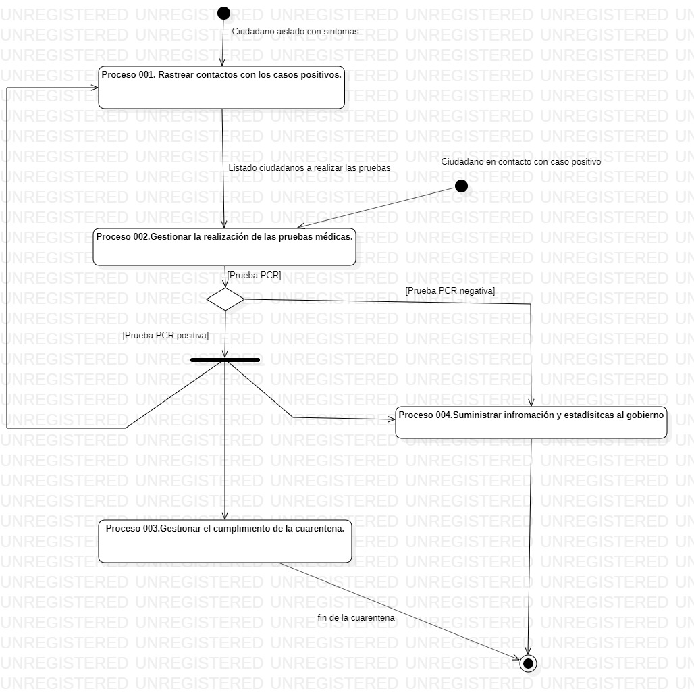

### 4.2 Modelos de Procesos de Negocio a Implantar

En este apartado representaremos y describiremos todos aquellos procesos que se llevarán acabo en nuestra plataforma PANDEMIO para gestionar los contagios que se producen en la pandemia, asi como los procesos que se emplearán para controlar el cumplimiento de la cuarentena obligatoria por parte de los ciudadanos positivos. También se tendrán en cuenta todos aquellos procesos en los que se gestionen las distintas pruebas médicas que se deben realizar los ciudadanos, asi como informales a estos de los resultados.Por otro lado, se especificará como debe ser la comunicación con el resto de actores que intervienen en la plataforma como los agentes de la autoridad o el gobierno al que se le proporcionarán todos los datos obtenidos con la plataforma para que puedan tomarse las medidas oportunas por parte de los expertos correspondientes.

#### 4.2.1 Descripción de los Actores de Negocio a Implantar
Los actores de negocio de nuestra plataforma PANDEMIO, son todas aquellas personas, entidades u organizaciones que están involucrados en los procesos de negocio a implantar, en este caso los actores de negocio de nuestra plataforma son los siguientes: ciudadanos, gobierno, autoridades y ambulatorios.

| **\<id>001** | Ciudadano |
| -- | -- |
| **[Versión]** | 1.0(28/11/2020) |
| **[Dependencias]** | * \<procesos de negocio actuales en los que participa>   * ... |
| **Descripción** | Este actor de negocio actual es el actor principal de la plataforma y representa a cada uno de los ciudadanos, de dicho actor se van a obtener todos los datos que se gestionarán por medio de la plataforma. De ellos por medio de sus dispositivos móviles, se va a poder acceder a cual ha sido su localización, las personas con las que ha estado en contacto, el tiempo que ha permanecido en un determinado lugar, etc. Toda esta información será procesada por la plataforma pandemio para poder obtener la información "depurada" y poderla suministrar a los distintos actores interesados como el gobierno, las autoridades o los ambulatorios.|
| **Comentarios** | De dicho actor se van a obtener sus datos por medio de los datos suministrados por las compañias telefónicas. |

 <b>Tabla 6.1: Actores de negocio a implantar.</b>

| **\<id>002** | Gobierno |
| -- | -- |
| **[Versión]** | 1.0(28/11/2020) |
| **[Dependencias]** | * \<procesos de negocio actuales en los que participa>   * ... |
| **Descripción** | Este actor de negocio actual representa al gobierno, en concreto al ministerio de sanidad y el comité de expertos, al que se le suministrarán todos los datos y estadísticas que se han obtenido por medio del procesamiento de los datos capturados de los ciudadanos y procesados por parte de nuestra plataforma pandemio. Dicho actor se encargará como entidad de tomar las decisiones oportunas en función de los datos suministrados por la plataforma, en base a diferentes criterios.
| **Comentarios** | El objetivo de nuestra plataforma es proporcionar los datos lo mejor procesados y "depurados" a este actor para que puedan tomar decisiones. |

 <b>Tabla 6.2: Actores de negocio a implantar.</b> 

| **\<id>003** | Autoridades |
| -- | -- |
| **[Versión]** | 1.0(28/11/2020) |
| **[Dependencias]** | * \<procesos de negocio actuales en los que participa>   * ... |
| **Descripción** | Este actor de negocio actual representa a las fuerzas del orden (policía local, nacional, guardia civil y el ejército) que deberán de ser informados del cumplimiento de la cuarentena y poder verificar que se está cumpliendo esta. Dicho actor podrá acceder a la información de los ciudadanos que estén en cuarentena para poder controlar que se cumplen dichas cuarentenas así como intervenir en el caso de que dejen de cumplirse o no se realicen las pruebas médicas oportunas.|
| **Comentarios** | Las autoridades dispondrán de dispositivos por medio de los cuales se les podrá notificar cuando un ciudadano no se ha presentado a hacerse las pruebas médicas, para que actuen en consecuencia. Por otra parte, también se les informará cuando deben de realizar los controles periódicos de que se cumple la cuarentena entre aquellos ciudadanos que deben cumplirla, será con la minoría de la población que no disponde de teléfono móvil o con aquellos que sí disponen de teléfono móvil pero que no es posible verificar que se encuentran en casa o es imposible contactar con ellos.|

 <b>Tabla 6.3: Actores de negocio a implantar.</b> 

| **\<id>004** | Ambulatorio |
| -- | -- |
| **[Versión]** | 1.0(28/11/2020) |
| **[Dependencias]** | * \<procesos de negocio actuales en los que participa>   * ... |
| **Descripción** | Este actor de negocio actual representa al centro de salud que dispondrá de listados donde se informarán del estado de los ciudadanos, así como de las distintas pruebas médicas que se les debe de realizar a cada uno de ellos. También se encargarán de notificar a los ciudadanos las citas en las que se les realizarán las pruebas, asi como las medidas que deben de tomar en caso de dar positivo y cual es la duración de la cuarentena que deben de cumplir.|
| **Comentarios** | Este actor podrá acceder a los datos de los ciudadanos (a sus datos médicos), también será el encargado de registrar el resultado de las pruebas realizadas a los ciudadanos en la plataforma pandemio, para que finalmente se pueda contabilizar dicho positivo y poder hacer un seguimiento de los contactos de dicho positivo, así como proporcionar los datos al gobierno. |

 <b>Tabla 6.4: Actores de negocio a implantar.</b>   

#### 4.2.2 Descripción de Procesos de Negocio a Implantar

En esta sección se especificarán cuales serán los procesos de negocio que se implementarán en nuestra plataforma PANDEMIO. Dichos procesos representarán a grandes rasgos la operativa de nuestra plataforma y el funcionamiento general de ella. De esta forma, definiremos como deberán de interactuar los actores definidos en el apartado anterior una vez que el sistema esté en producción. Los procesos de negocio a implementar serán los siguientes.

| **\<id>001** | Rastrear contactos con los casos positivos |
| -- | -- |
| **[Versión]** | 1.0(29/11/2020) |
| **[Dependencias]** | Para que se lleve a cabo este proceso de negocio, se podrán presentar dos situaciones distintas. La primera es que un ciudadano aislado acuda al ambulatorio porque presenta síntomas compatibles con el virus y de positivo en las pruebas. La segunda, es que tras realizarse el proceso de negocio 002 el rastreo de los contactos con los casos positivos alguno de ellos de positivo en las pruebas. En definitiva, este proceso de negocio se dispara cuando hay algún ciudadano que de positivo en las pruebas. |
| **Descripción** | En este proceso de negocio, se llevará a cabo un rastreo de los contactos que haya podido tener un caso positivo confirmado con otros ciudadanos, para ello se podrá realizar este seguimiento por medio de los datos de la localización que nos proporcionen las operadoras telefónicas de los ciudadanos. Nuestra plataforma será capaz de trazar dicha información obteniendo las personas que hayan estado en el mismo lugar que el positivo durante un tiempo superior de 15 minutos, para que a dichas personas posteriormente se les realicen las pruebas médicas oportunas (proceso de negocio 002 Gestionar la realización de las pruebas médicas). También, la plataforma podrá obtener información de cuales han sido los focos de contagios entre los casos que estén relacionados. |
| **[Importancia]** | Alta |
| **[Actores]** | * Ciudadano    |
| **Comentarios** | Para llevar a cavo este proceso de rastreo es necesario conocer los datos de la localización de los ciudadanos suministrados por las operadoras telefónicas de estos. El proceso de rastreo requiere de algoritmos complejos. |

 <b>Tabla 7.1: Procesos de Negocio a implantar.</b>   

| **\<id>002** | Gestionar la realización de las pruebas médicas |
| -- | -- |
| **[Versión]** | 1.0(29/11/2020) |
| **[Dependencias]** | Dicho proceso de negocio depende del proceso de negocio 001 Rastrear los contactos con los casos positivos, para poder obtener el listado de las personas a las que se les debe de realizar las pruebas médicas. |
| **Descripción** | Una vez que se ha llevado a cabo el proceso de negocio 001 Rastrear contactos con los casos positivos, la plataforma PANDEMIO suministrará un listado con todos aquellos ciudadanos que sean sospechosos de tener el virus al estar en contacto con un caso positivo confirmado. Una vez que el ambulatorio conozca dicho listado, se encargará de concertar una cita con el ciudadano para que se le realicen las pruebas médicas oportunas y registrarán en la plataforma dicha cita. La plataforma enviará un SMS al ciudadano informandole de que debe de realizarse las pruebas médicas y cuando se le ha concertado la cita para ello.  En caso de que algún ciudadano no acuda a la cita médica, el ambulatorio lo registrará en la plataforma y esta se pondrá en contacto con las autoridades para informarle de qué ciudadano no acudió a hacerse las pruebas médicas para que actuen en consecuencia.  Una vez que se conozca el resultado de las pruebas médicas, los ambulatorios registrarán el resultado en la plataforma y esta informará a los ciudadanos de los resultados por medio de SMS, además de que el ambulatorio contacte con ellos vía telefónica para informarles de cuales deben de ser las medidas a adoptar, cuarentenas, etc. Si el resultado de la prueba es positivo, se volverá al proceso de negocio 001 Rastrear contactos con los casos positivos y se repetirá el proceso. También entrará en acción el proceso de negocio 003 Gestionar el cumplimiento de la cuarentena|
| **[Importancia]** | Alta |
| **[Actores]** | * Ambulatorio>  * Ciudadano  * Autoridades |
| **Comentarios** | Cuando un ciudadano no acuda a la realización de las pruebas médicas las autoridades se encargarán de localizarle para que se realicen.|

 <b>Tabla 7.2: Procesos de Negocio a implantar.</b>   

| **\<id>003** | Gestionar el cumplimiento de la cuarentena |
| -- | -- |
| **[Versión]** | 1.0(29/11/2020) |
| **[Dependencias]** | Dicho proceso de negocio depende del proceso de negocio 002 Gestionar la realización de las pruebas médicas, dado que el control del cumplimiento de las cuarentenas solo se llevará a cabo en aquellos ciudadanos que hayan dado positivo en las pruebas que se les han realizado o en los ciudadanos que se indique que deben de mantener cuarentena.|
| **Descripción** | Una vez que en la plataforma se conozca cuales son los ciudadanos que deben de cumplir la cuarentena, se llevará a cabo un control de que esta se cumple. Para ello, la plataforma se encargará de localizar a los ciudadanos que deben de cumplir la cuarentena por medio de su telefono móvil, pidiendo que ponga su huella dactilar y localizando el teléfono móvil o por medio de llamadas telefónicas cuando los dispositivos no dispongan de huella dactilar. Cuando se detecte que un ciudadano no cumple la cuarentena por medio de cualquiera de las técnicas anteriores, el sistema informará a las autoridades de su incumplimiento y actuarán en consecuencia. Cuando el sistema detecte que un usuario que debe permanecer en cuarenta está incumpliendola, el sistema se lo notificará por medio de un SMS. |
| **[Importancia]** | Alta |
| **[Actores]** | * Ciudadano   * Autoridades |
| **Comentarios** | Si el ciudadano que debe de cumplir cuarentena pertenece al pequeño porcentaje de la población que no dispone de teléfono móvil se informará a las autoridades para que lleven a cabo los controles de cumplimiento de la cuarentena de forma presencial en su domicilio. |

 <b>Tabla 7.3: Procesos de Negocio a implantar.</b>   

| **\<id>004** | Suministrar información y estadísticas al gobierno |
| -- | -- |
| **[Versión]** | 1.0(29/11/2020) |
| **[Dependencias]** | Dicho proceso de negocio depende de los procesos de negocio 001 Rastrera contactos con los casos positivos y 002 Gestionar la realización de las pruebas médicas, para que se disponga de la información de los casos positivos y cuales han sido los contactos entre ellos.|
| **Descripción** | Este proceso de negocio es el proceso de negocio sobre el que se basa nuestra plataforma PANDEMIO, a partir del rastreo llevado a cabo en el proceso de negocio 001, la plataforma dipondrá de la información relativa a los casos positivos, los contactos entre los casos positivos, las zonas en las que se han producido y los focos de contagios. El sistema elaborará estadísticas con todos estos datos y serán proporcionados al gobierno, para que dicha información sea interpretada por el comité de expertos y se tomen las medidas oportunas |
| **[Importancia]** | Muy Alta|
| **[Actores]** | * Gobierno |
| **Comentarios** | La información recopilada por la plataforma será proporcionada constantemente al gobierno, asi como cada nuevo caso positivo registrado en la plataforma.|

 <b>Tabla 7.4: Procesos de Negocio a implementar.</b>  

A continuación se muestra un diagrama de actividad que modela el funcionamiento general del sistema, indicando cuales son los procesos de negocio que se han de llevar a acabo.

  

