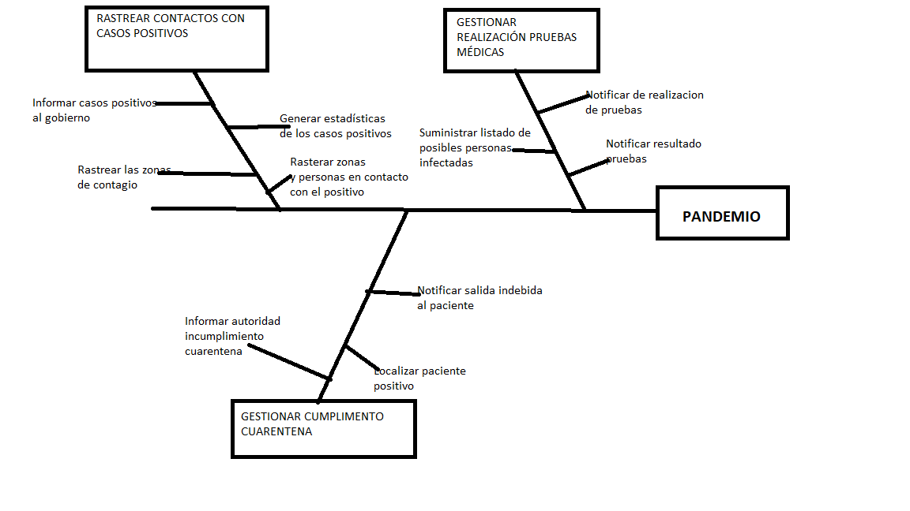

# 1 INTRODUCCIÓN
Ante los resultados decepcionantes obtenidos con la aplicación **Radar Covid** para llevar a cabo el rastreo de los contagios entre los ciudadanos durante la pandemia, el Ministro de Sanidad ha propuesto desarrollar una plataforma que permita rastrear los casos Covid, así como gestionar los datos de los ciudadanos que sean positivos.

Con esta nueva plataforma que se propone desarrollar, se desea mitigar aquellos problemas que se han encontrado en la ya existente aplicación **Radar Covid**. Entre los cuales el comité de expertos resalta que son debidos a que la instalación y el uso de la app NO eran obligatorios, por lo que pocos usuarios la instalaron y además dicha aplicación al basarse en el uso de bluetooth, la aplicación era inservible si el bluetooth estaba apagado o bien estaba ocupado.

Además se propone que la nueva plataforma a desarrollar pueda llevar a cabo un seguimiento de aquellos ciudadanos que deben cumplir la cuarentena y no la cumplian, asi como aquellos que no acudian a hacerse las pruebas médicas oportunas. Donde resulta importante que se cumpla la ley de datos y los datos de los ciudadanos solo sean usados por las personas autorizadas y sean anonimizados cuando sea posible.

## 1.1 Alcance
Con el desarrollo de la plataforma PANDEMIO, se busca conseguir un sistema de control e información acerca de los contagios que se dan en una pandemia, en este caso de Covid-19, pero también nos servirá para otras pandemias que se pudieran presentar en un futuro.

Pandemio proporcionará distintos datos acerca de los contagios de los ciudadanos al ministerio de Sanidad, para que dichos datos sean procesados y se tomen las medidas oportunas por parte del juicio de expertos correspondiente. También, se proporcionarán los datos necesarios acerca de los contagios a los ambulatorios, así como a las autoridades correspondientes para que puedan llevar a cabo un control de que los casos positivos cumplen la cuarentena obligatoria cuando sea necesario.
El alcance del proyecto, se centra principalmente en tres grandes características, el rastreo de los contactos con los casos positivos, gestionar la realización de las pruebas médicas y gestionar el cumplimiento de la cuarentena. Dentro de cada una de estas carcterísticas se incluirá diferente funcionalidad, a continuación se muestra un diagrama de característica en el cual se plasma cual es el alcance del proyecto de una forma más precisa.
  

## 1.2 Objetivos
Entre los objetivos que se desean alcanzar al desarrollar dicha plataforma se encuentran:

- Llevar a cabo un rastreo de los casos positivos entre los ciudadanos, así como conocer las personas que hayan estado en contacto con un positivo (durante un tiempo superior a 15 minutos)
- LLevar a cabo un control del correcto cumplimiento de la cuarentena por aquellos ciudadanos que la deban cumplir, notificando a la autoridad cuando se deja de cumplir la cuarentena.
- LLevar a cabo un control de aquellos ciudadanos que deben presentarse a las pruebas médicas oportunas, así como el resultado de estas.
- Proporcionar información de los distintos casos positivos que se detectan al ministerio de Sanidad, se debe informar del número de casos positivos que se encuentran en una determinada zona, ya sea por barrios, pueblos, etc. Para que los expertos epidemiologos puedan tomar las medidas oportunas a partir de estos datos.
- Rastrear donde se han podido ocasionar los contagios entre los casos positivos, para que dicha información sea proporcionada al ministerio de sanidad y pueda tomar las medidas oportunas sobre permitir ciertas actividades o no.
